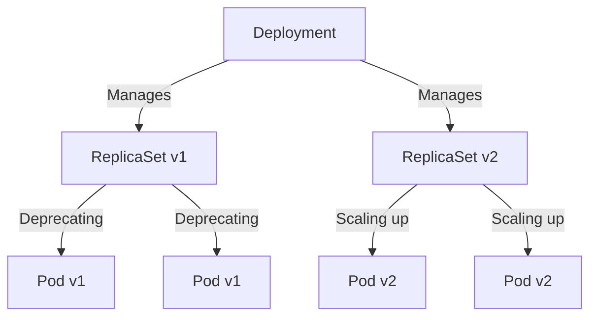

# ReplicaSet и Deployment

## DevOps-история: Боль и Решение
**Боль:** Раньше мы запускали поды напрямую или через ReplicationController. При обновлении версии приложения (например, с v1 на v2) приходилось вручную гасить старые поды и поднимать новые. Это приводило к даунтаймам (downtime) и нервным ночным деплоям. Откатиться назад было ещё сложнее.
**Решение:** Появились `Deployment` и `ReplicaSet`. `ReplicaSet` (RS) следит за тем, чтобы всегда было запущено нужное количество реплик (подов). А `Deployment` управляет `ReplicaSet'ами`, обеспечивая декларативное обновление (Rolling Updates), позволяя плавно перекатывать версии без даунтайма и легко делать Rollback.

## Архитектура и связи (Mermaid)



## Примеры (YAML / Bash)

**Пример Deployment:**
```yaml
apiVersion: apps/v1
kind: Deployment
metadata:
  name: nginx-deployment
  labels:
    app: nginx
spec:
  replicas: 3
  selector:
    matchLabels:
      app: nginx
  strategy:
    type: RollingUpdate
    rollingUpdate:
      maxSurge: 1       # Сколько подов можно создать сверх replicas
      maxUnavailable: 0 # Сколько подов может быть недоступно
  template:
    metadata:
      labels:
        app: nginx
    spec:
      containers:
      - name: nginx
        image: nginx:1.14.2
        ports:
        - containerPort: 80
```

**Полезные команды:**
```bash
# Обновить образ (запустить деплой)
kubectl set image deployment/nginx-deployment nginx=nginx:1.16.1

# Посмотреть статус раскатки
kubectl rollout status deployment/nginx-deployment

# Откатиться на предыдущую версию
kubectl rollout undo deployment/nginx-deployment
```

## Day 2 Operations
- **Horizontal Pod Autoscaler (HPA):** Не меняйте `replicas` в манифесте вручную, если используете HPA. Пусть HPA управляет масштабированием на основе метрик (CPU/RAM).
- **Readiness/Liveness Probes:** Обязательно настраивайте пробы! Без Readiness probe Deployment во время RollingUpdate пустит трафик на под, который ещё не готов его обрабатывать.
- **Graceful Shutdown:** Приложение должно корректно обрабатывать SIGTERM, чтобы не обрывать текущие пользовательские запросы при удалении пода во время деплоя.

## Антипаттерны
- **Использование latest тега:** Избегайте `image: my-app:latest`. Вы не сможете понять, какая именно версия сейчас запущена, и триггерить обновления будет сложнее.
- **Ручное создание ReplicaSet:** Никогда не создавайте ReplicaSet напрямую. Используйте Deployment, иначе потеряете функционал плановых обновлений.
- **Отсутствие resource limits:** Развертывание без `resources.requests` и `resources.limits` приведет к нестабильности узлов (OOMKilled).
