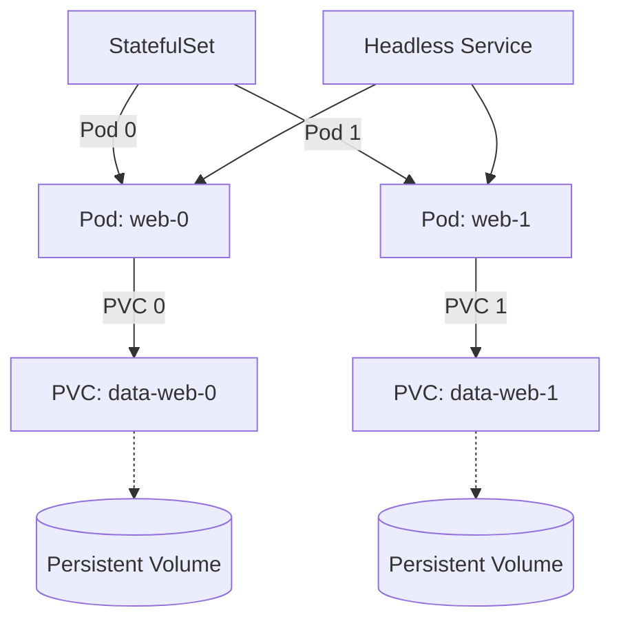

# StatefulSet

## DevOps-история: Боль и Решение
**Боль:** Мы научились деплоить stateless-приложения (API, фронтенд) через Deployments. Поды там — как скот (cattle), их можно убивать и заменять в любой момент, они не имеют уникальности. Но что делать с базами данных (PostgreSQL, MongoDB) или брокерами сообщений (Kafka), где каждому поду нужен свой постоянный диск, свой постоянный сетевой идентификатор, и запускаться они должны строго по очереди?
**Решение:** `StatefulSet`. В отличие от Deployment, он гарантирует порядок развертывания (0, 1, 2...) и уникальность каждого пода. Каждому поду выдается предсказуемое имя (например, `db-0`, `db-1`) и свой собственный PersistentVolumeClaim, который не пересоздается при перезапуске пода.

## Архитектура и связи (Mermaid)



## Примеры (YAML / Bash)

**Пример StatefulSet (и Headless Service):**
```yaml
apiVersion: v1
kind: Service
metadata:
  name: nginx-hl
  labels:
    app: nginx
spec:
  ports:
  - port: 80
    name: web
  clusterIP: None # Headless Service - важен для StatefulSet
  selector:
    app: nginx
---
apiVersion: apps/v1
kind: StatefulSet
metadata:
  name: web
spec:
  selector:
    matchLabels:
      app: nginx
  serviceName: "nginx-hl"
  replicas: 3
  template:
    metadata:
      labels:
        app: nginx
    spec:
      containers:
      - name: nginx
        image: registry.k8s.io/nginx-slim:0.24
        ports:
        - containerPort: 80
          name: web
        volumeMounts:
        - name: www
          mountPath: /usr/share/nginx/html
  volumeClaimTemplates:
  - metadata:
      name: www
    spec:
      accessModes: [ "ReadWriteOnce" ]
      resources:
        requests:
          storage: 1Gi
```

**Полезные команды:**
```bash
# Масштабирование
kubectl scale statefulset web --replicas=5

# Принудительное удаление зависшего пода (опасно!)
kubectl delete pod web-0 --force --grace-period=0
```

## Day 2 Operations
- **Headless Service:** Всегда создавайте Headless Service (`clusterIP: None`) для StatefulSet. Это позволяет подам обращаться друг к другу по предсказуемым DNS-именам (например, `web-0.nginx-hl.default.svc.cluster.local`).
- **Резервное копирование:** StatefulSet не делает бекапы ваших данных. Используйте внешние инструменты (например, Velero или операторы баз данных) для создания снапшотов PV.
- **Удаление StatefulSet:** При удалении StatefulSet (`kubectl delete sts ...`) PVC (и сами данные) **не удаляются** автоматически. Это защита от потери данных, но это нужно учитывать при очистке среды.

## Антипаттерны
- **Базы данных в чистом StatefulSet:** Если это production база, лучше использовать специализированные Kubernetes Operators (например, Postgres Operator от Zalando или Percona), чем писать сырой StatefulSet. Операторы умеют управлять бэкапами, репликацией и фейловером.
- **Использование emptyDir:** Не используйте `emptyDir` тома в StatefulSet, так как данные будут потеряны при рестарте пода, что убивает весь смысл "Stateful". Используйте `volumeClaimTemplates`.
- **Force delete без понимания:** Принудительное удаление пода (`--force`) может привести к split-brain в кластерах баз данных. Делайте это только если нода окончательно мертва.
