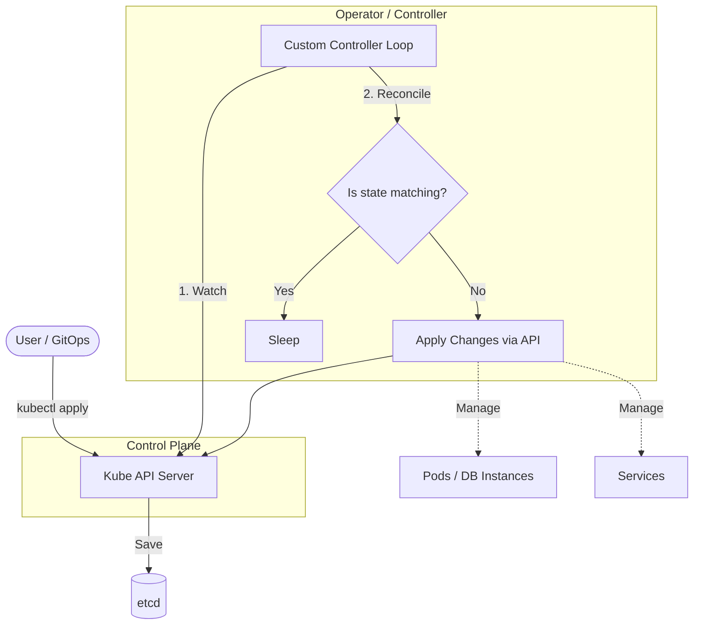

# CRD (Custom Resource Definitions) и Operators

## 📖 DevOps Story (Боль и Решение)
**Боль:** У вас есть stateful приложение (например, база данных PostgreSQL или сложная очередь), которое требует сложной логики при обновлении, создании бэкапов или масштабировании. Обычных Deployment и StatefulSet не хватает — нужно выполнять shell скрипты, менять конфиги на лету и следить за лидером.
**Решение:** **CRD и Operator Pattern**. CRD позволяет расширить Kubernetes API своими собственными объектами (например, `PostgreSQLCluster`), а Operator — это кастомный контроллер (pod), который следит за этими ресурсами и реализует всю сложную логику эксплуатации ("Day 2" задачи), как если бы за базой следил живой SRE-инженер.

## 📐 Архитектура (Mermaid)



## 💻 Примеры (YAML/bash)

**Пример CRD (упрощенно):**
```yaml
apiVersion: apiextensions.k8s.io/v1
kind: CustomResourceDefinition
metadata:
  name: mydatabases.example.com
spec:
  group: example.com
  versions:
    - name: v1alpha1
      served: true
      storage: true
      schema:
        openAPIV3Schema:
          type: object
          properties:
            spec:
              type: object
              properties:
                size:
                  type: integer
  scope: Namespaced
  names:
    plural: mydatabases
    singular: mydatabase
    kind: MyDatabase
```

**Использование Custom Resource (CR):**
```yaml
apiVersion: example.com/v1alpha1
kind: MyDatabase
metadata:
  name: prod-db
spec:
  size: 3 # Оператор увидит это и создаст 3 пода БД
```

## 🛠️ Day 2 Operations
- **Выбор фреймворка:** Не пишите операторы с нуля на bash. Используйте Operator SDK (Go, Ansible, Helm) или Kubebuilder.
- **Идемпотентность — всё:** Функция Reconcile в операторе должна быть идемпотентной. Она может вызываться много раз подряд из-за сбоев сети. Она должна проверять текущее состояние и применять изменения только если они нужны.
- **Метрики:** Обязательно экспортируйте Prometheus метрики из вашего оператора (например, очередь reconcile loop, ошибки, состояния управляемых ресурсов).

## ⚠️ Антипаттерны
- **Оператор для всего подряд:** Не нужно писать оператор для stateless приложения, если вам просто нужно создать Deployment + Service. Используйте Helm или Kustomize. Операторы нужны для сложной логики.
- **Блокирующий Reconcile:** Цикл синхронизации не должен зависать на долгих операциях (например, ожидание дампа БД на 2 часа). Используйте паттерн "State Machine" с асинхронными статусами (`Pending`, `BackingUp`, `Ready`).
- **Игнорирование RBAC:** Оператору нужны права для создания подов/сервисов. Не давайте ему права `cluster-admin` "на всякий случай". Соблюдайте принцип наименьших привилегий.
