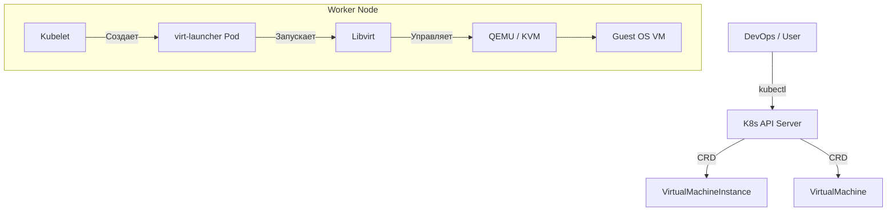

# KubeVirt (VM в K8s)

## 📖 История: Боль и Решение

**Боль:** У вас есть современные микросервисы в Kubernetes и устаревшие (или монолитные) приложения, которые могут работать только в виртуальных машинах (VM). Поддерживать два разных оркестратора (например, vCenter/OpenStack для VM и Kubernetes для контейнеров) дорого, сложно и требует двойной работы администраторов, настройки двух разных сетей и политик безопасности.

**Решение:** **KubeVirt** стирает границы между контейнерами и виртуальными машинами. Это расширение Kubernetes (набор CRD и контроллеров), которое позволяет запускать классические виртуальные машины (QEMU/KVM) внутри стандартных подов Kubernetes. Теперь вы можете управлять VM с помощью `kubectl`, применять GitOps, деплоить их вместе с контейнерами и использовать общие сети (CNI) и хранилища (CSI).

## 🏗 Архитектура



## 💻 Примеры

### Запуск простой VM (Ubuntu)
```yaml
apiVersion: kubevirt.io/v1
kind: VirtualMachine
metadata:
  name: ubuntu-vm
spec:
  running: true
  template:
    metadata:
      labels:
        kubevirt.io/size: small
    spec:
      domain:
        resources:
          requests:
            memory: 2048M
        devices:
          interfaces:
          - name: default
            masquerade: {}
          disks:
          - name: containerdisk
            disk:
              bus: virtio
      networks:
      - name: default
        pod: {}
      volumes:
      - name: containerdisk
        containerDisk:
          image: quay.io/kubevirt/ubuntu-container-disk-demo
```

### Управление VM (Bash/virtctl)
```bash
# Для удобного управления VM нужен плагин virtctl
kubectl virt start ubuntu-vm
kubectl virt stop ubuntu-vm
kubectl virt console ubuntu-vm # Подключиться к консоли
```

## 🛠 Day 2 Operations (Советы по эксплуатации)

1. **CDI (Containerized Data Importer):** Используйте CDI для импорта образов дисков (qcow2, raw) из внешних источников (HTTP, S3, Registry) напрямую в PersistentVolumeClaim (PVC). Это основа для работы с постоянными дисками виртуалок.
2. **Мониторинг:** Интегрируйте `kubevirt-prometheus-metrics`. В KubeVirt есть встроенный экспортер метрик QEMU, который покажет потребление CPU, RAM и IOPS конкретными виртуалками.
3. **Сеть:** По умолчанию виртуалки получают IP пода (masquerade/bridge). Если виртуалке нужен L2 доступ во внешнюю сеть, используйте Multus CNI для подключения дополнительных интерфейсов (Macvlan, SR-IOV).
4. **Ресурсы:** Тщательно настраивайте `requests` и `limits`. Если OOMKiller убьет `virt-launcher` под, ваша виртуалка жестко "выключится по питанию".

## ❌ Антипаттерны

- **"Давайте засунем все базы данных в KubeVirt":** Если вам нужна БД в K8s, лучше используйте нативные операторы (например, Zalando Postgres Operator или CloudNativePG). KubeVirt нужен для legacy-приложений, а не для избегания контейнеризации.
- **Микроменеджмент:** Управление виртуалками вручную через `virtctl` в production. Виртуалки в KubeVirt должны быть описаны как код (GitOps) так же, как и обычные K8s Deployment.
- **Игнорирование Live Migration:** Если вы используете локальные диски (hostPath/LocalPV), виртуалка не сможет мигрировать на другую ноду при drain. Используйте сетевые хранилища (Ceph/Rook, NFS) в режиме `ReadWriteMany`, чтобы Live Migration работала.
