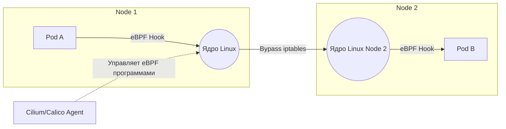

# CNI (Calico, Cilium, eBPF)

## История (Боль и Решение)
**Боль:** Долгое время стандартом де-факто для Kube-proxy и многих CNI (Container Network Interface) были правила `iptables`. По мере роста кластеров (тысячи подов и сервисов) таблицы правил разрастались до гигантских размеров. Это приводило к огромным задержкам при обновлении правил, падению производительности сети (линейный поиск по таблице) и делало траблшутинг невозможным. Базовые NetworkPolicies тоже ограничены лишь IP/портами (L3/L4).

**Решение:** **Современные CNI с поддержкой eBPF** (Cilium, Calico eBPF data plane). Технология eBPF позволяет выполнять безопасный байт-код прямо в ядре Linux, перехватывая сетевые пакеты на самом низком уровне. Это полностью устраняет overhead от `iptables` и `netfilter`. Результат: маршрутизация работает со скоростью нативного ядра, появляется невероятная наблюдаемость (за счет трейсинга пакетов в ядре), а сетевые политики могут фильтровать трафик вплоть до L7 (HTTP-методы, пути).

## Архитектура


## Примеры
**Bash (Установка Cilium в режиме полной замены kube-proxy):**
```bash
cilium install \
  --set kubeProxyReplacement=true \
  --set hubble.relay.enabled=true \
  --set hubble.ui.enabled=true
```

**YAML (Политика CiliumNetworkPolicy на уровне L7):**
```yaml
apiVersion: "cilium.io/v2"
kind: CiliumNetworkPolicy
metadata:
  name: "lock-down-api"
spec:
  endpointSelector:
    matchLabels:
      app: api-server
  ingress:
  - fromEndpoints:
    - matchLabels:
        app: frontend
    toPorts:
    - ports:
      - port: "8080"
        protocol: TCP
      rules:
        http:
        - method: "GET" # Разрешаем только GET запросы!
          path: "/public-data"
```

## Day 2 Operations
- **Наблюдаемость (Observability):** При использовании eBPF обязательно разворачивайте инструменты визуализации. Hubble для Cilium позволяет видеть каждый отброшенный пакет и строить граф сервисов в реальном времени. Используйте CLI для дебага: `hubble observe --pod my-pod --verdict DROPPED`.
- **Мониторинг метрик ядра:** Экспортируйте метрики CNI в Prometheus. Обращайте особое внимание на размер eBPF maps (таблиц состояний). Если они переполнятся, новые соединения будут отбрасываться.
- **Обновления ОС:** eBPF-программы тесно связаны с версией ядра Linux. Перед апгрейдом ОС на нодах всегда проверяйте матрицу совместимости вашего CNI с новым ядром.

## Антипаттерны
- **Использование kube-proxy вместе с eBPF CNI:** Запуск современного eBPF CNI параллельно с работающим kube-proxy. Если CNI умеет полностью заменять его (как Cilium в strict mode), kube-proxy нужно удалять, чтобы избежать дублирования правил и потери производительности.
- **Отсутствие Default Deny политик:** Оставлять неймспейсы без базовых политик "запретить все" в надежде на то, что CNI сам разберется. eBPF CNI мощные, но подход Zero Trust (NetworkPolicies по умолчанию) все еще обязателен.
- **Игнорирование MTU:** Неправильно настроенный MTU в CNI для облачного провайдера (например, AWS использует 9001, а туннелирование отнимает байты). Это приведет к дропам пакетов и фантомным зависаниям соединений, которые очень сложно отладить даже с помощью eBPF.
