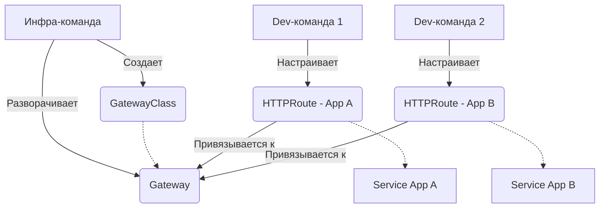

# Gateway API (Современный стандарт)

## История (Боль и Решение)
**Боль:** Традиционный ресурс `Ingress` стал "бутылочным горлышком". Он создавался с прицелом только на HTTP-трафик и не поддерживал расширенные функции из коробки. Это привело к тому, что провайдеры (Nginx, HAProxy) обросли десятками нестандартных и несовместимых аннотаций (`nginx.ingress.kubernetes.io/rewrite-target`). Кроме того, `Ingress` не разделяет роли — разработчики и администраторы инфраструктуры вынуждены делить один объект, что ведет к конфликтам и ошибкам.

**Решение:** **Gateway API**. Это новый, расширяемый и стандартизированный подход к маршрутизации (поддерживает L4 и L7). Он основан на ролевой модели: провайдеры создают `GatewayClass`, инфраструктурщики разворачивают `Gateway` (слушатели/порты), а разработчики привязывают к ним свои `HTTPRoute`/`TCPRoute`. Это позволяет безопасно делегировать управление трафиком (сплиттинг, канареечные релизы, хэдеры) без хардкода проприетарных аннотаций.

## Архитектура


## Примеры
**Gateway (создает администратор):**
```yaml
apiVersion: gateway.networking.k8s.io/v1
kind: Gateway
metadata:
  name: main-gateway
  namespace: infra
spec:
  gatewayClassName: cilium # или nginx, envoy, и т.д.
  listeners:
  - name: http
    protocol: HTTP
    port: 80
    allowedRoutes:
      namespaces:
        from: All # Разрешаем роуты из любых неймспейсов
```

**HTTPRoute (создает разработчик приложения):**
```yaml
apiVersion: gateway.networking.k8s.io/v1
kind: HTTPRoute
metadata:
  name: my-app-route
  namespace: my-app
spec:
  parentRefs:
  - name: main-gateway
    namespace: infra
  hostnames:
  - "myapp.example.com"
  rules:
  - matches:
    - path:
        type: PathPrefix
        value: /api
    backendRefs:
    - name: my-app-svc
      port: 8080
```

## Day 2 Operations
- **Траблшутинг через статусы:** Ресурсы Gateway API (в отличие от Ingress) пишут детальную информацию об ошибках и привязках прямо в свой статус. Проверяйте: `kubectl get httproute my-app-route -o yaml` и смотрите блок `status`.
- **Кросс-неймспейс безопасность:** Используйте `ReferenceGrant`, если `HTTPRoute` находится в одном неймспейсе, а бекенд `Service` — в другом. Это защищает от несанкционированного перехвата трафика.
- **Миграция:** Используйте официальную утилиту `ingress2gateway` для автоматической конвертации старых Ingress ресурсов в новые манифесты Gateway API.

## Антипаттерны
- **Один гигантский Gateway для всего:** Не запихивайте внутренний, внешний и критичный трафик в один Gateway. Разделяйте их по логическим доменам или уровням безопасности.
- **Возврат к проприетарным аннотациям:** Старайтесь использовать встроенные фичи Gateway API (фильтры, таймауты, редиректы). Цель стандарта — vendor-neutrality. Если вы снова используете аннотации конкретного прокси, вы теряете главный плюс.
- **Отсутствие лимитов в allowedRoutes:** Разрешать привязку маршрутов из *всех* неймспейсов (`from: All`) к публичному Gateway может привести к тому, что тестовое приложение разработчика случайно вылезет на внешний домен. Фильтруйте по селекторам!
