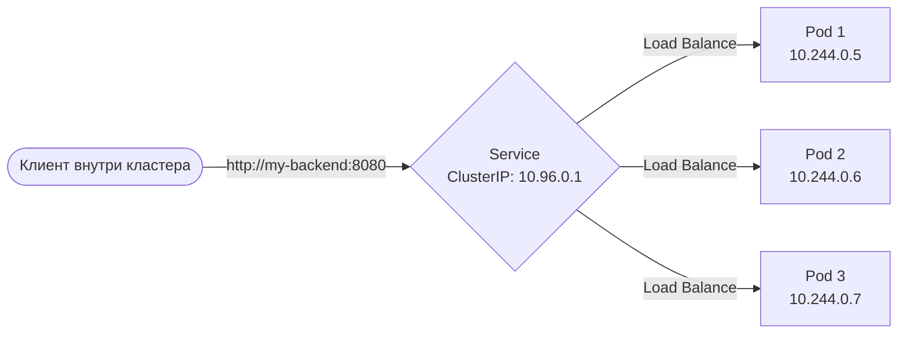

# Kubernetes Services

## История (Боль и Решение)
**Боль:** Поды в Kubernetes эфемерны. При каждом деплое, падении узла или масштабировании поды пересоздаются с новыми IP-адресами. Если фронтенду нужно постоянно обращаться к бэкенду, жестко прописывать IP бессмысленно — все сломается через минуту.
**Решение:** **Service (Сервис)**. Это абстракция, которая предоставляет стабильный виртуальный IP-адрес (ClusterIP) и DNS-имя для набора подов (определяемых через `selector`). Service берет на себя роль внутреннего балансировщика нагрузки.

## Архитектура



## Типы Service
1. **ClusterIP** (по умолчанию) — доступен только внутри кластера.
2. **NodePort** — открывает порт (обычно 30000-32767) на каждом узле кластера. Доступен снаружи как `NodeIP:NodePort`.
3. **LoadBalancer** — запрашивает внешний балансировщик у облачного провайдера (AWS ELB, GCP LB).
4. **ExternalName** — проксирует запросы на внешнее DNS-имя (создает CNAME).

## Примеры (YAML / Bash)

### ClusterIP Service
```yaml
apiVersion: v1
kind: Service
metadata:
  name: backend-service
spec:
  type: ClusterIP
  selector:
    app: backend
  ports:
    - protocol: TCP
      port: 80       # Порт самого Service
      targetPort: 8080 # Порт на поде
```

### Применение
```bash
kubectl apply -f service.yaml
kubectl get svc backend-service
# Проверка DNS внутри кластера:
kubectl run -i --tty --rm debug --image=busybox --restart=Never -- nslookup backend-service
```

## Day 2 Operations
- **Endpoint Slices:** В больших кластерах (сотни подов за одним сервисом) традиционный ресурс `Endpoints` становится узким местом. Используйте `EndpointSlices` для более эффективного обновления правил маршрутизации в kube-proxy.
- **Headless Services (`clusterIP: None`):** Используйте для Stateful-приложений (баз данных), когда вам не нужна балансировка, а нужны прямые IP-адреса всех подов через DNS.
- **Мониторинг:** Отслеживайте метрики отторжения соединений и время ответа (часто через Service Mesh, если используется).

## Антипаттерны 🚫
- **NodePort для продакшена в облаке:** NodePort неудобен для прямого клиентского трафика и требует сложных настроек фаервола. Используйте LoadBalancer или Ingress.
- **Несовпадение Selector и Labels:** Самая частая ошибка. Если Service не находит поды, проверьте `kubectl get endpoints backend-service`. Если пусто — лейблы не совпадают.
- **Создание Service без Readiness Probe в подах:** Service будет отправлять трафик на поды, которые еще не готовы принимать запросы. Обязательно настраивайте readiness/liveness пробы.
