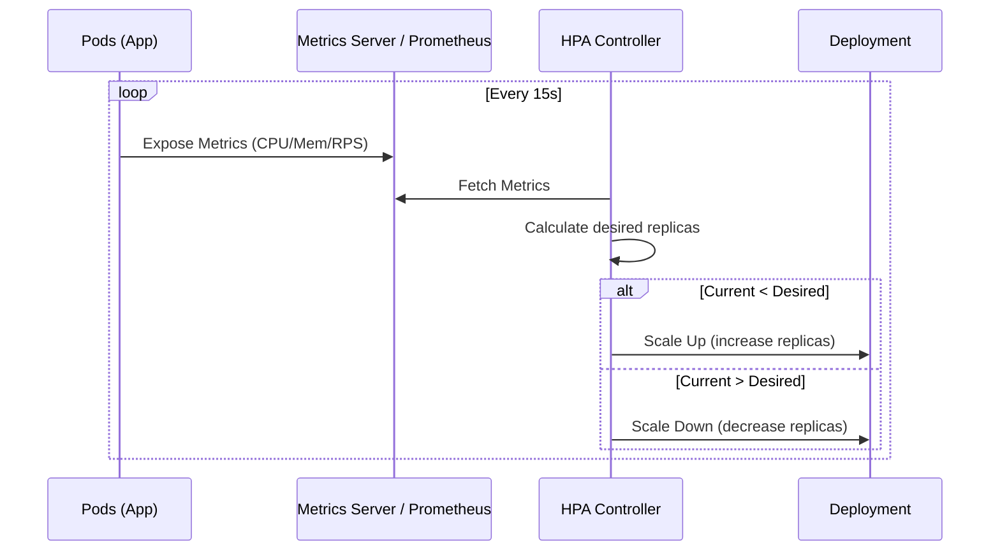

# Автомасштабирование: HPA и VPA

## 📖 История из жизни: Боль и Решение
**Боль:** Черная пятница. Трафик на ваш интернет-магазин вырастает в 10 раз. Статичное количество подов не справляется, OOMKilled сыпятся один за другим, клиенты получают 502 Bad Gateway. Вы вручную правите `replicas: 20` в Deployment, но после спада нагрузки кластер продолжает сжигать деньги, работая вхолостую. Другая проблема — вы не знаете, сколько памяти нужно новому Java-приложению, ставите "на глаз", и оно постоянно падает от нехватки хипа.
**Решение:** Horizontal Pod Autoscaler (HPA) для динамического изменения количества реплик в зависимости от нагрузки (CPU/RAM/Custom Metrics) и Vertical Pod Autoscaler (VPA) для автоматической подстройки `requests` и `limits` под реальное потребление.

## 📐 Архитектура



## 🛠️ Практические примеры (YAML)

### Horizontal Pod Autoscaler (HPA)
Масштабирование по CPU (требует Metrics Server):
```yaml
apiVersion: autoscaling/v2
kind: HorizontalPodAutoscaler
metadata:
  name: frontend-hpa
spec:
  scaleTargetRef:
    apiVersion: apps/v1
    kind: Deployment
    name: frontend
  minReplicas: 2
  maxReplicas: 10
  metrics:
  - type: Resource
    resource:
      name: cpu
      target:
        type: Utilization
        averageUtilization: 70
```

### Vertical Pod Autoscaler (VPA)
Автоматическая настройка ресурсов:
```yaml
apiVersion: autoscaling.k8s.io/v1
kind: VerticalPodAutoscaler
metadata:
  name: backend-vpa
spec:
  targetRef:
    apiVersion: apps/v1
    kind: Deployment
    name: backend
  updatePolicy:
    updateMode: "Auto" # "Off" для режима рекомендаций (без перезапуска)
```

## ⚙️ Day 2 Operations
- **Режим "Off" в VPA:** Перед тем как включить VPA в режим `Auto` (который будет рестартовать поды для применения новых лимитов), запустите его в режиме `Off`. Он будет просто собирать метрики и писать рекомендации в `status` объекта VPA.
- **Prometheus Adapter:** Используйте кастомные метрики для HPA (например, длина очереди RabbitMQ или RPS из Ingress) через Prometheus Adapter, так как CPU — не всегда показатель реальной нагрузки.
- **Настройка Cooldown:** Настраивайте `behavior` в HPA, чтобы избежать "flapping" (постоянного скалирования туда-сюда). Увеличьте `scaleDown.stabilizationWindowSeconds`.

## 🚫 Антипаттерны
1. **HPA и VPA вместе на CPU/Mem:** Использование HPA и VPA одновременно на одних и тех же метриках (CPU/RAM) вызовет конфликт. HPA будет пытаться добавить поды, а VPA — увеличить их размер. Если нужны оба, HPA должен реагировать на кастомные метрики (RPS), а VPA — на CPU/RAM.
2. **Отсутствие Requests в подах:** HPA по утилизации ресурсов (в %) не будет работать, если у подов не заданы `requests`, так как контроллеру не от чего считать процент.
3. **Слишком низкий maxReplicas:** Ограничение `maxReplicas` в HPA до малых значений из страха потратить ресурсы может привести к отказу в обслуживании при реальном спайке трафика.
