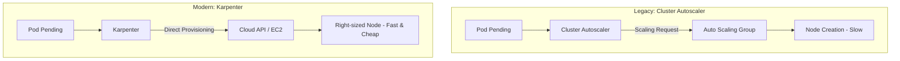

# Karpenter и Cluster Autoscaler

## 📖 DevOps-история: Боль и Решение
**Боль:** Внезапный наплыв трафика, например, во время распродажи. Поды висят в `Pending`. Классический **Cluster Autoscaler (CA)** реагирует медленно, так как он жестко привязан к Auto Scaling Groups (ASG) в облаке. В ASG фиксированные типы инстансов, и масштабирование занимает минуты. В итоге мы либо переплачиваем за простаивающие ресурсы (overprovisioning), либо пользователи видят ошибки таймаутов, пока поднимается новая нода.
**Решение:** **Karpenter**. Он работает напрямую с API облака (например, AWS EC2), минуя громоздкие ASG. Karpenter смотрит на требования подов (CPU, RAM, nodeSelector) и за миллисекунды заказывает *идеально подходящий* инстанс (включая Spot). А когда нагрузка падает, он "переупаковывает" поды (consolidate), удаляя лишние ноды для экономии.

## 🏗 Архитектура (Mermaid)


## 💻 Примеры

### Karpenter: NodePool (замена ASG)
```yaml
apiVersion: karpenter.sh/v1beta1
kind: NodePool
metadata:
  name: default
spec:
  template:
    spec:
      requirements:
        - key: karpenter.sh/capacity-type
          operator: In
          values: ["spot", "on-demand"] # Разрешаем Spot и On-Demand
        - key: kubernetes.io/arch
          operator: In
          values: ["amd64", "arm64"] # Позволяем Karpenter выбирать архитектуру
      nodeClassRef:
        name: default
  limits:
    cpu: 1000
    memory: 1000Gi
  disruption:
    consolidationPolicy: WhenUnderutilized
    expireAfter: 720h # Ротация нод каждые 30 дней для безопасности
```

## 🛠 Day 2 Operations
- **Консолидация (Consolidation):** Обязательно включите `consolidationPolicy: WhenUnderutilized`. Karpenter будет автоматически "переупаковывать" поды на меньшее количество нод или на более дешевые ноды при спаде нагрузки.
- **Spot Interruption:** Настройте обработку прерываний Spot-инстансов. Karpenter умеет слушать события облака (например, AWS SQS) и заранее дренировать (cordon & drain) ноду до того, как облако её принудительно заберет.
- **Мониторинг:** Настройте алерты Prometheus на метрики `karpenter_nodepool_limit` (чтобы кластер не уперся в лимиты vCPU/RAM) и отслеживайте соотношение Spot vs On-Demand нод для контроля костов.

## ❌ Антипаттерны
1. **CA и Karpenter дерутся за ресурсы:** Использование обоих автоскейлеров для управления одними и теми же пулами нод. Их нужно жестко разделять (через nodeSelector/taints) или полностью выключить CA.
2. **Отсутствие PodDisruptionBudgets (PDB):** Без PDB агрессивная консолидация Karpenter может одновременно "убить" все реплики критичного приложения, вызвав downtime.
3. **Жесткая фиксация `instance-type`:** Указание конкретных типов инстансов (например, `t3.medium`) в requirements Karpenter. Это убивает главную фичу инструмента — свободу выбора самых дешевых/доступных инстансов на основе запрашиваемых vCPU/Memory.
