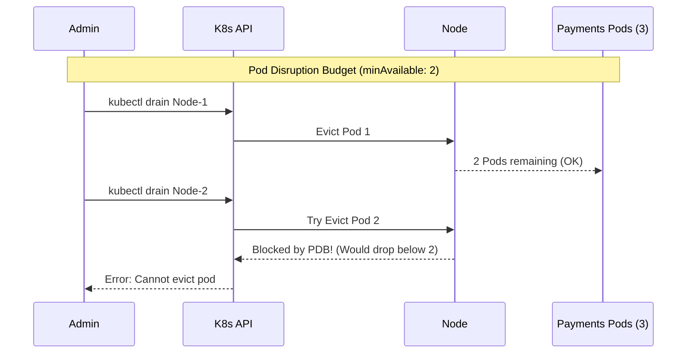

# PriorityClass и Pod Disruption Budget

## История (Боль и Решение)
**Боль:** Во время планового обновления узлов (drain) скрипт одновременно выключил ноды с нашими микросервисами, и все реплики сервиса платежей легли. Дополнительно, когда в кластере закончились ресурсы, планировщик не мог запустить критичный под базы данных, потому что место было занято фоновыми cron-джобами.
**Решение:** Мы внедрили **Pod Disruption Budget (PDB)**, чтобы Kubernetes гарантировал минимально доступное количество реплик (например, всегда работает минимум 2 пода платежей) во время drain. Для критичных компонентов создали **PriorityClass**, чтобы при нехватке ресурсов база данных могла вытеснить (evict) менее важные cron-джобы и запуститься.

## Mermaid-схема



## Примеры (YAML/Bash)

**1. Создание PriorityClass:**
```yaml
apiVersion: scheduling.k8s.io/v1
kind: PriorityClass
metadata:
  name: high-priority-db
value: 1000000
globalDefault: false
description: "Используется для критичных подов БД."
```

**2. Назначение приоритета поду:**
```yaml
apiVersion: v1
kind: Pod
metadata:
  name: postgres-primary
spec:
  containers:
  - name: postgres
    image: postgres:13
  priorityClassName: high-priority-db
```

**3. Настройка Pod Disruption Budget (PDB):**
```yaml
apiVersion: policy/v1
kind: PodDisruptionBudget
metadata:
  name: payment-service-pdb
spec:
  # Можно использовать maxUnavailable вместо minAvailable
  minAvailable: 2 
  selector:
    matchLabels:
      app: payment-service
```

## Day 2 Operations (Советы)
- **Использование `maxUnavailable` при обновлениях:** Вместо `minAvailable: 2`, часто удобнее использовать процентные соотношения вроде `maxUnavailable: 25%`. Это делает PDB гибким при масштабировании Deployment.
- **Интеграция с Cluster Autoscaler:** Убедитесь, что для подов-жертв (с низким приоритетом), которые были вытеснены, Cluster Autoscaler сможет заказать новые узлы, чтобы они не висели вечно в `Pending`.
- **Preemption Policy:** В Kubernetes 1.15+ PriorityClass поддерживает `preemptionPolicy: Never`. Это полезно для "тяжелых" задач, которые должны стоять в очереди первыми, но не должны убивать уже бегущие поды.

## Антипаттерны
- **PDB `maxUnavailable: 0` или `minAvailable: 100%`:** Полностью блокирует любой плановый drain нод. Кластер невозможно будет обновить без ручного удаления PDB или принудительного удаления подов.
- **Инфляция приоритетов:** Когда каждая команда разработки создает свой "super-critical-priority" класс со значением 999999999. Используйте ограниченный набор стандартных PriorityClasses (например: low, default, high, critical) под управлением платформенной команды.
- **PriorityClass без Requests/Limits:** Если под с высоким приоритетом не имеет лимитов и начнет течь по памяти (OOM), он может убить ноду, что гораздо хуже, чем если бы его просто не запланировали.
