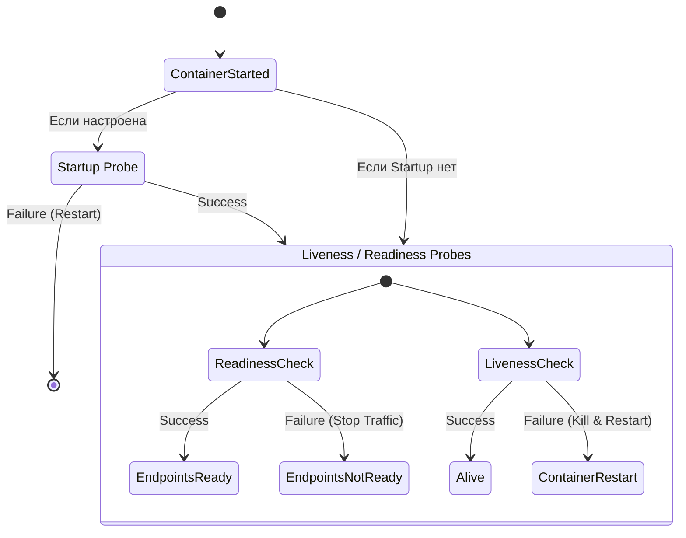

# Probes (Liveness, Readiness, Startup)

## 📖 История: Боль и Решение
**Боль:** Сервер базы данных запускался долго (около 2 минут). В это время балансировщик (Service) уже начал направлять на него пользовательский трафик, что приводило к шквалу ошибок 502/503. А иногда приложение зависало в dead-lock: процесс работал, но запросы не обрабатывал, и Kubernetes думал, что всё отлично.
**Решение:** Внедрение трех типов проб (Health Checks). **Startup** дает приложению время на долгую инициализацию. **Readiness** сообщает Service, когда можно пускать трафик. **Liveness** перезапускает контейнер, если он "завис" и не отвечает.

## 📊 Жизненный цикл проб



## 💻 Примеры (YAML)

```yaml
apiVersion: apps/v1
kind: Deployment
metadata:
  name: probe-demo
spec:
  template:
    spec:
      containers:
      - name: my-app
        image: my-app:v1
        ports:
        - containerPort: 8080
        
        startupProbe:
          httpGet:
            path: /healthz
            port: 8080
          failureThreshold: 30
          periodSeconds: 10 # Итого 300с на долгий старт
          
        readinessProbe:
          httpGet:
            path: /ready
            port: 8080
          initialDelaySeconds: 5
          periodSeconds: 5
          
        livenessProbe:
          tcpSocket:
            port: 8080
          initialDelaySeconds: 15
          periodSeconds: 20
```

## 🛠 Виды проверок (Handlers)
1. **HTTP GET**: Проверка статус кода (200-399 = Success).
2. **TCP Socket**: Проверка успешности установки TCP-соединения.
3. **Exec**: Выполнение команды в контейнере (exit 0 = Success).
4. **gRPC**: Нативная поддержка gRPC health checking (с версии 1.24).

## 🚀 Day 2 Operations (Советы)
- **Тюнинг таймаутов:** Аккуратно настраивайте `timeoutSeconds` и `failureThreshold`. Слишком агрессивные пробы приведут к ложным перезапускам при кратковременных всплесках нагрузки (CPU spikes).
- **Graceful Shutdown:** Readiness probe начинает фейлиться при получении SIGTERM, поэтому важно настроить `preStop` хук или обрабатывать сигнал в приложении, чтобы корректно завершить старые запросы, пока Endpoint удаляется.
- **Изоляция проверок:** Эндпоинты `/health` и `/ready` не должны делать сложную бизнес-логику.

## ❌ Антипаттерны
- **Проверка внешних зависимостей в Liveness:** Если ваша БД упадет, Liveness probe начнет убивать ваши поды (каскадный сбой). Приложение должно выживать при недоступности БД (например, возвращая ошибку, но оставаясь живым). Зависимости можно проверять в Readiness (чтобы не пускать трафик).
- **Использование Liveness вместо Startup:** Установка огромного `initialDelaySeconds` в Liveness для компенсации долгого старта. Если приложение запустится быстро, оно останется без мониторинга на время этого делэя.
- **Одинаковые Liveness и Readiness:** Часто это бессмысленно. Если Readiness падает, мы просто снимаем трафик. Если падает Liveness — рестартим под. Разделите логику "я готов принимать запросы" и "я окончательно завис".
