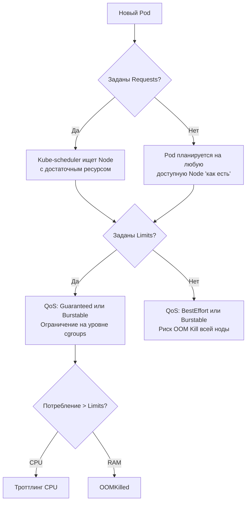

# Requests, Limits, QoS

## 📖 История: Боль и Решение
**Боль:** В пятницу вечером один из микросервисов начал течь по памяти (memory leak). Поскольку он был запущен без ограничений, он потребил всю память на ноде, что привело к OOM (Out of Memory) убийству других важных системных подов (kubelet, CNI) и падению всей ноды (Noisy Neighbor problem).
**Решение:** Внедрение **Requests** (гарантированные ресурсы для планирования) и **Limits** (жесткие ограничения потребления), что позволяет Kubernetes корректно распределять поды по нодам и присваивать им классы обслуживания (**QoS**). Теперь проблемный под убивается сам (OOMKilled), не затрагивая соседей.

## 📊 Архитектура и Логика



## 💻 Примеры (YAML)

```yaml
apiVersion: v1
kind: Pod
metadata:
  name: resource-demo
spec:
  containers:
  - name: app
    image: nginx
    resources:
      requests:
        memory: "256Mi"
        cpu: "250m"
      limits:
        memory: "512Mi"
        cpu: "500m"
```

## 🛠 QoS Classes (Качество обслуживания)
1. **Guaranteed**: Requests == Limits для CPU и RAM. Самый высокий приоритет.
2. **Burstable**: Requests < Limits, или заданы не для всех ресурсов. Средний приоритет (может быть убит при нехватке памяти, если превышает requests).
3. **BestEffort**: Requests и Limits не заданы. Первый кандидат на OOM Kill при нехватке памяти на ноде.

## 🚀 Day 2 Operations (Советы)
- **Используйте Vertical Pod Autoscaler (VPA)** в режиме Recommendation для сбора статистики о реальном потреблении и корректировки requests/limits.
- **Мониторинг:** Настройте алерты Prometheus на `container_cpu_cfs_throttled_seconds_total` (CPU throttling) и постоянное приближение RAM к limits.
- **LimitRanges:** Настройте дефолтные значения limits/requests на уровне Namespace, чтобы разработчики не забывали их указывать.
- **ResourceQuotas:** Ограничьте общее потребление ресурсов для Namespace.

## ❌ Антипаттерны
- **Одинаковые Requests и Limits для CPU:** CPU — сжимаемый ресурс (compressible). Лучше ставить requests по реальному базовому потреблению, а limits вообще не ставить или ставить сильно выше, чтобы избежать ненужного троттлинга.
- **Слишком большие Limits по памяти:** Приведет к тому, что под убьет OOM killer операционной системы ноды, а не kubelet.
- **Отсутствие Requests по памяти:** Планировщик может "перегрузить" ноду, что приведет к частым эвикциям.
