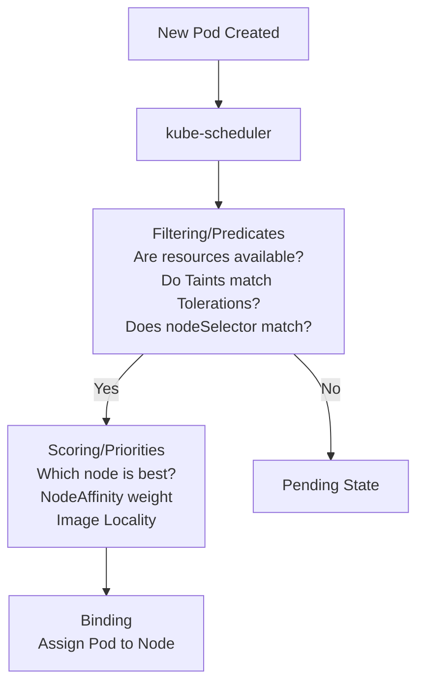

# Kubernetes Scheduling: Управление размещением подов

## 📖 История из жизни: Боль и Решение
**Боль:** Ваше приложение, требующее GPU для ML-моделей, случайно запускается на обычных worker-нодах и падает с ошибками. В то же время, легковесные микросервисы занимают дорогие GPU-ноды. Начинается хаос, ресурсы тратятся неэффективно, а критичные поды висят в статусе `Pending`.
**Решение:** Использование механизмов Kube-Scheduler — `nodeSelector`, `Affinity/Anti-Affinity`, а также `Taints` и `Tolerations` для жесткого контроля за тем, куда и как размещаются поды.

## 📐 Архитектура и Логика



## 🛠️ Практические примеры (YAML)

### Taints и Tolerations (Отпугивание подов)
Делаем ноду доступной только для особых подов:
```bash
# Вешаем taint на ноду
kubectl taint nodes gpu-node-1 accelerator=nvidia-gpu:NoSchedule
```
Настраиваем Pod, чтобы он мог там запуститься:
```yaml
apiVersion: v1
kind: Pod
metadata:
  name: ml-worker
spec:
  containers:
  - name: model-runner
    image: my-gpu-app
  tolerations:
  - key: "accelerator"
    operator: "Equal"
    value: "nvidia-gpu"
    effect: "NoSchedule"
```

### Node Affinity (Притяжение подов)
Более гибкая замена `nodeSelector`:
```yaml
apiVersion: v1
kind: Pod
metadata:
  name: web-app
spec:
  affinity:
    nodeAffinity:
      requiredDuringSchedulingIgnoredDuringExecution:
        nodeSelectorTerms:
        - matchExpressions:
          - key: disktype
            operator: In
            values:
            - ssd
      preferredDuringSchedulingIgnoredDuringExecution:
      - weight: 1
        preference:
          matchExpressions:
          - key: zone
            operator: In
            values:
            - us-east-1a
  containers:
  - name: nginx
    image: nginx
```

## ⚙️ Day 2 Operations
- **Мониторинг:** Следите за метрикой `kube_pod_status_phase{phase="Pending"}` в Prometheus. Если поды долго висят, проверьте `kubectl describe pod <name>` (раздел Events) для понимания причин (например, нехватка CPU или отсутствие подходящих нод).
- **Topology Spread Constraints:** Используйте `topologySpreadConstraints` для равномерного распределения подов по зонам доступности или нодам, чтобы пережить падение целой зоны.
- **Descheduler:** Kube-scheduler работает только при создании пода. Чтобы перебалансировать кластер с течением времени, используйте [Descheduler](https://github.com/kubernetes-sigs/descheduler).

## 🚫 Антипаттерны
1. **Жесткая привязка к конкретным именам нод (`nodeName`):** Если нода умрет, под никогда не пересоздастся на другой. Используйте лейблы.
2. **Игнорирование Anti-Affinity:** Размещение всех реплик критичного сервиса на одной ноде. Обязательно используйте `podAntiAffinity`, чтобы разнести реплики.
3. **Чрезмерно строгие правила:** Использование только `requiredDuringScheduling...` может привести к тому, что при небольших сбоях или нехватке ресурсов поды просто не запустятся. Разбавляйте их `preferredDuringScheduling...`.
