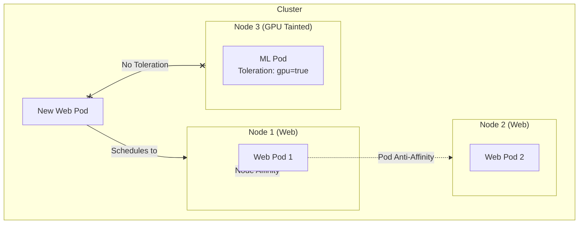

# Taints, Tolerations, Affinity

## История (Боль и Решение)
**Боль:** Мы развернули в одном кластере веб-приложения и тяжелые ML-нагрузки. ML-воркеры заняли все ресурсы, вытеснив веб-поды, а сами веб-поды периодически оказывались на одной ноде, из-за чего падение этой ноды валило весь фронтенд. 
**Решение:** С помощью **Taints и Tolerations** мы зарезервировали GPU-ноды только для ML-задач (веб-поды туда не идут), а через **Node Affinity** и **Pod Anti-Affinity** распределили веб-поды по разным зонам доступности и запретили им селиться на одних и тех же узлах.

## Mermaid-схема



## Примеры (YAML/Bash)

**1. Добавление Taint на ноду:**
```bash
kubectl taint nodes node3 gpu-node=true:NoSchedule
```

**2. Конфигурация пода (Toleration + Affinity):**
```yaml
apiVersion: v1
kind: Pod
metadata:
  name: ml-worker
  labels:
    app: ml
spec:
  # Позволяет поду запускаться на нодах с этим taint
  tolerations:
  - key: "gpu-node"
    operator: "Equal"
    value: "true"
    effect: "NoSchedule"
  
  affinity:
    # Привязка к нодам определенного типа
    nodeAffinity:
      requiredDuringSchedulingIgnoredDuringExecution:
        nodeSelectorTerms:
        - matchExpressions:
          - key: disktype
            operator: In
            values:
            - ssd
    # Запрет на запуск рядом с подами такого же приложения
    podAntiAffinity:
      preferredDuringSchedulingIgnoredDuringExecution:
      - weight: 100
        podAffinityTerm:
          labelSelector:
            matchExpressions:
            - key: app
              operator: In
              values:
              - ml
          topologyKey: "kubernetes.io/hostname"
  containers:
  - name: ml-container
    image: my-ml-image:latest
```

## Day 2 Operations (Советы)
- **Используйте `preferred` вместо `required`:** При использовании Affinity/Anti-Affinity начинайте с `preferredDuringSchedulingIgnoredDuringExecution`, чтобы планировщик мог разместить под, даже если идеальные условия не выполнены (избегает зависания в статусе `Pending`).
- **Разделяйте роли через Labels:** Поддерживайте строгую и понятную конвенцию лейблов для нод и подов. Это упростит создание правил Affinity.
- **Мониторинг:** Настройте алерты на поды, которые находятся в статусе `Pending` более 5 минут. Это частый признак слишком строгих правил Affinity или нехватки нод с нужными Tolerations.

## Антипаттерны
- **Использование только `required` Anti-Affinity в маленьких кластерах:** Если у вас 3 ноды и вы требуете, чтобы 4 реплики жили на разных нодах с `required` Anti-Affinity, 4-й под никогда не запустится.
- **Избыток Taints:** Навешивание Taints на каждую ноду по любому поводу превращает кластер из оркестратора в набор статических виртуалок. Теряется смысл динамического планирования.
- **Taint без NoExecute для эвикции:** Использование эффекта `NoSchedule` не выселяет уже запущенные поды. Если нужно очистить ноду от "неправильных" подов, используйте `NoExecute`.
