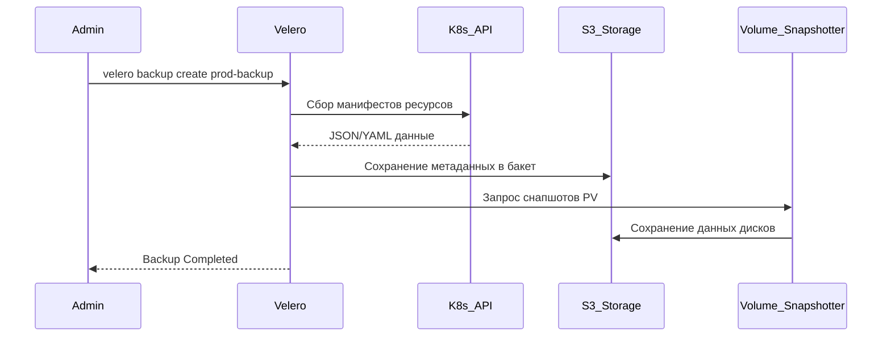

# Эксплуатация Kubernetes (Backup, Upgrade, Troubleshooting)

## 📖 История: Боль и Решение
**Боль:** Кластер внезапно "упал", кто-то случайно удалил namespace `prod`, или обновление минорной версии сломало API (например, удалили v1beta1). Без подготовки это приводит к даунтайму, потере данных и седым волосам дежурных инженеров.
**Решение:** Регулярные бекапы состояния кластера и данных (Velero), четкий пайплайн обновлений через staging и уверенное владение базовыми командами отладки (Troubleshooting).

## 🗺️ Схема резервного копирования (Velero)


## 💻 Примеры (Troubleshooting & Velero)

**Базовый траблшутинг пода:**
```bash
# 1. Что с подом? (События и статус)
kubectl describe pod <pod-name> -n <namespace>

# 2. Что в логах?
kubectl logs <pod-name> -n <namespace> 
kubectl logs <pod-name> -n <namespace> --previous # Если под рестартанул

# 3. Что внутри? (Дебаг)
kubectl exec -it <pod-name> -n <namespace> -- sh
# Или эфемерный дебаг-контейнер (k8s 1.25+)
kubectl debug -it <pod-name> --image=busybox:1.28 --target=<container-name>
```

**Работа с Velero:**
```bash
# Создание бекапа с ожиданием завершения
velero backup create my-backup --include-namespaces app-namespace --wait

# Восстановление из бекапа
velero restore create --from-backup my-backup
```

## 🛠️ Day 2 Operations
- **Disaster Recovery Drills:** Регулярно (раз в квартал) тестируйте восстановление кластера из бекапов Velero в пустой кластер. Бекап Шредингера не работает, пока его не восстановили.
- **Стратегия апгрейдов (Blue/Green Cluster):** Для критичных систем лучше поднять новый кластер новой версии, перенести туда нагрузки и переключить трафик, чем обновлять кластер in-place.
- **Release Notes:** Всегда читайте ченджлог Kubernetes перед обновлением, особенно секцию "Deprecations and Removals". Используйте утилиты типа `pluto` или `kubepug` для поиска устаревших API в ваших манифестах.

## ⚠️ Антипаттерны
- **Обновление в пятницу вечером:** Выполнение in-place upgrade кластера без предварительного тестирования на dev/stage окружениях.
- **Бекап etcd вместо бекапа ресурсов:** Снятие только бекапа etcd без привязки к персистентным томам (PV). Velero решает эту проблему комплексно.
- **Слепая вера в Liveness Probes:** Настройка проб, которые убивают под при кратковременных скачках сети или нагрузки, вызывая каскадные рестарты всего сервиса.
