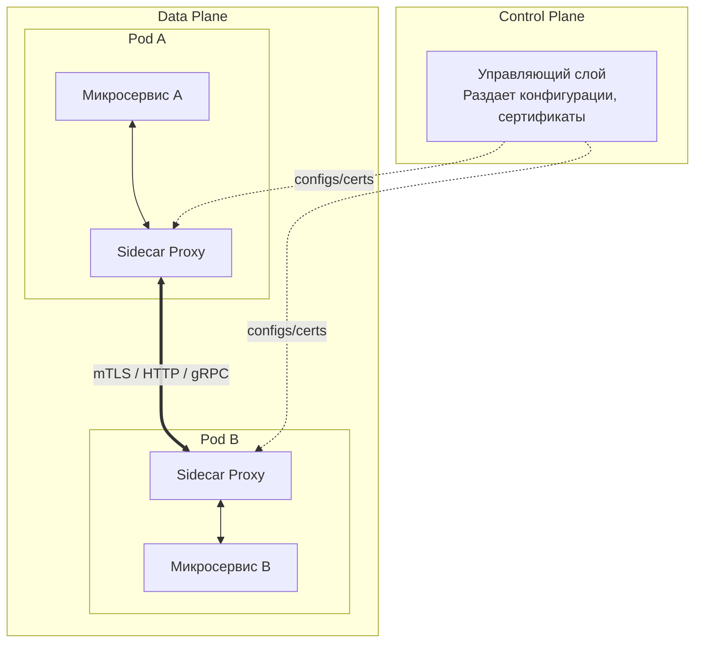

# Основы Service Mesh

## Боль и решение (DevOps-история)

**Боль:** По мере роста количества микросервисов разработчики начинают тратить огромное количество времени на реализацию сетевой логики в каждом сервисе. Обнаружение сервисов (Service Discovery), балансировка нагрузки, повторные попытки (Retries), Circuit Breaker, таймауты, шифрование трафика (mTLS) и сбор метрик встраиваются в код. Это приводит к дублированию кода, расхождениям в реализациях для разных языков и огромному техническому долгу.

**Решение:** Вынесение всей сетевой логики и политик безопасности на уровень инфраструктуры. Service Mesh внедряет прозрачный прокси-сервер (Sidecar) рядом с каждым экземпляром сервиса. Приложения общаются по localhost, а Sidecar-прокси перехватывают весь трафик, реализуя безопасность, маршрутизацию и наблюдаемость.

## Архитектура Service Mesh



## Примеры

**Включение Sidecar Injection в Kubernetes (Bash):**
```bash
# Добавление лейбла на namespace для автоматического внедрения sidecar
kubectl label namespace default service-mesh-injection=enabled
```

**Абстрактный манифест политики mTLS (YAML):**
```yaml
apiVersion: security.mesh.io/v1
kind: PeerAuthentication
metadata:
  name: default-mtls
  namespace: default
spec:
  mtls:
    mode: STRICT # Запрет нешифрованного трафика
```

## Советы Day 2 operations

1. **Мониторинг ресурсов Sidecar'ов:** Прокси потребляют CPU и RAM. Обязательно настраивайте Requests/Limits для Sidecar контейнеров на основе профиля трафика.
2. **Наблюдаемость (Observability):** Используйте метрики RED (Rate, Errors, Duration), генерируемые Service Mesh, как основной источник правды для алертов (SLA/SLO).
3. **Плавное обновление:** Обновляйте Control Plane отдельно от Data Plane. Используйте механизм ревизий (revisions), чтобы тестировать новую версию Control Plane на части ворклоадов.
4. **Трассировка:** Настройте проброс заголовков трассировки (например, `x-b3-traceid`, `x-request-id`) в самом приложении, даже если Mesh делает остальную работу.

## Антипаттерны

- **Бизнес-логика в Mesh:** Попытка реализовать сложную трансформацию payload'а или авторизацию на основе бизнес-сущностей на уровне Service Mesh. Mesh должен оперировать сетевыми примитивами (HTTP-заголовки, токены, пути), а не бизнес-данными.
- **Service Mesh "просто чтобы было":** Внедрение Mesh в системе из 3-5 сервисов без реальной необходимости. Это приносит неоправданный оверхед на инфраструктуру и эксплуатацию.
- **Дублирование таймаутов и Retries:** Настройка агрессивных повторных попыток одновременно и в коде приложения, и в конфигурации Service Mesh. Это может привести к "шторму ретраев" и каскадным сбоям.
