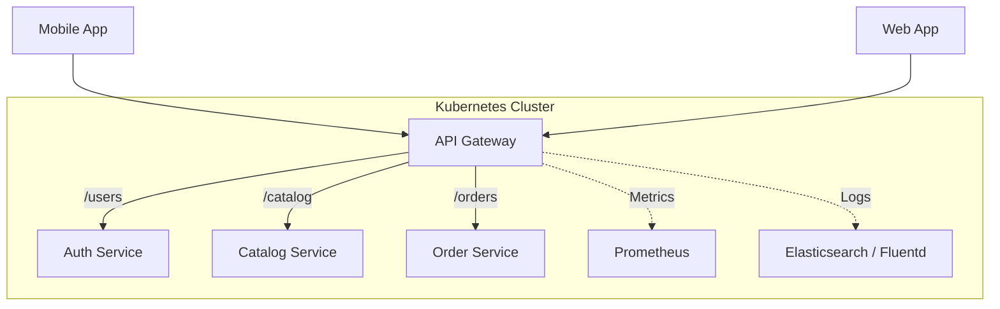

# API Gateway (Kong, Traefik, Ambassador)

## История (Боль и Решение)
**Боль:** По мере роста микросервисов клиентам (фронтенд, мобильные приложения, внешние интеграции) становится сложно обращаться к десяткам различных сервисов напрямую. Возникают проблемы с аутентификацией на каждом сервисе, CORS, rate limiting и управлением трафиком.
**Решение:** Внедрение API Gateway (единой точки входа). Он выступает как фасад, маршрутизируя запросы к нужным сервисам, централизованно решая задачи SSL-терминации, аутентификации (JWT/OAuth), ограничения трафика и мониторинга, тем самым разгружая бизнес-логику микросервисов.

## Архитектура



## Сравнение решений
- **Kong:** Базируется на Nginx/OpenResty. Очень мощный, расширяемый за счет плагинов (Lua, Go). Отличный выбор для сложных API-менеджмент задач.
- **Traefik:** Написан на Go. Нативная интеграция с Kubernetes и Docker, автообнаружение сервисов, автоматический Let's Encrypt. Идеально для динамичных cloud-native сред.
- **Ambassador (Emissary-ingress):** Базируется на Envoy. Создан специально для Kubernetes (управление через CRD). Отлично подходит, если вы уже строите экосистему вокруг Envoy или Istio.

## Примеры конфигурации

**Traefik IngressRoute (Kubernetes CRD с Rate Limit):**
```yaml
apiVersion: traefik.containo.us/v1alpha1
kind: IngressRoute
metadata:
  name: my-app-route
spec:
  entryPoints:
    - websecure
  routes:
    - match: Host(`api.example.com`) && PathPrefix(`/v1/users`)
      kind: Rule
      services:
        - name: user-service
          port: 8080
      middlewares:
        - name: rate-limit
---
apiVersion: traefik.containo.us/v1alpha1
kind: Middleware
metadata:
  name: rate-limit
spec:
  rateLimit:
    average: 100
    burst: 50
```

## Day 2 Operations (Советы)
- **High Availability:** Развертывайте API Gateway минимум в 2 репликах с настроенным PodDisruptionBudget.
- **Graceful Shutdown:** Настройте connection draining, чтобы при деплое новых версий Gateway старые поды не обрывали текущие пользовательские запросы.
- **Кэширование и Rate Limiting:** Обязательно настройте rate limiting по IP или Client ID для защиты от DDoS и брутфорса, а также используйте кэширование на уровне шлюза для частых неизменяемых запросов.
- **Глобальная аутентификация:** Используйте Gateway для проверки JWT токенов, передавая в бекенд только подтвержденные данные пользователя (например, в заголовке `X-User-Id`).

## Антипаттерны
- **Толстый API Gateway (ESB 2.0):** Попытка засунуть бизнес-логику, сложную агрегацию данных или трансформацию сообщений в плагины Gateway. Gateway должен заниматься только роутингом и сквозным L7 функционалом.
- **Единая точка отказа:** Отсутствие масштабирования Gateway. При падении единственного инстанса ложится весь проект.
- **Ручное управление сертификатами:** В современных реалиях нужно использовать автоматическую ротацию (cert-manager для Kubernetes или встроенные механизмы Traefik).
