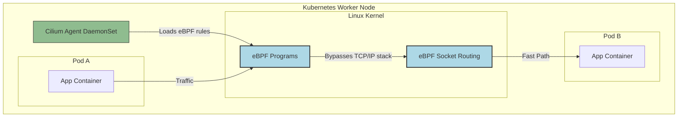

# Cilium Service Mesh (eBPF)

## 📖 DevOps-история (Боль и Решение)

**Боль:** Использование классического Service Mesh на базе sidecar-прокси (как Istio или Linkerd) привело к проблемам масштабирования. В кластере на тысячи подов sidecar-контейнеры потребляют слишком много ресурсов (RAM/CPU), добавляют сетевую задержку на каждом хопе (TCP/IP стек проходится несколько раз) и усложняют запуск Job/CronJob, так как sidecar нужно корректно убивать при завершении основной задачи.

**Решение:** **Cilium Service Mesh** использует технологию **eBPF** (extended Berkeley Packet Filter) на уровне ядра Linux. Это позволяет реализовать Sidecar-less архитектуру. Вместо того чтобы запускать прокси в каждом поде, Cilium управляет сетевым трафиком, балансировкой, безопасностью и mTLS прямо в ядре операционной системы. Это радикально снижает оверхед, уменьшает задержки и упрощает архитектуру.

---

## 🏗 Архитектура (Mermaid)



---

## 💻 Примеры (Bash / YAML)

### Установка Cilium с Service Mesh
Установка через Helm с включением фичей Service Mesh (Gateway API, Ingress, mTLS).

```bash
helm repo add cilium https://helm.cilium.io/

helm install cilium cilium/cilium \
    --namespace kube-system \
    --set hubble.relay.enabled=true \
    --set hubble.ui.enabled=true \
    --set kubeProxyReplacement=true \
    --set gatewayAPI.enabled=true \
    --set l7Proxy=true
```

### Cilium Network Policy (L7 Security)
Cilium позволяет ограничивать не только IP/порты, но и HTTP-методы/пути на уровне ядра!

```yaml
apiVersion: "cilium.io/v2"
kind: CiliumNetworkPolicy
metadata:
  name: "rule-frontend-to-backend"
spec:
  endpointSelector:
    matchLabels:
      app: backend
  ingress:
  - fromEndpoints:
    - matchLabels:
        app: frontend
    toPorts:
    - ports:
      - port: "8080"
        protocol: TCP
      rules:
        http:
        - method: "GET"
          path: "/api/v1/data"
```

---

## 🛠 Day 2 Operations (Советы по эксплуатации)

1. **Используйте Hubble для Observability:** Hubble — это компонент Cilium для сетевой видимости. Команда `hubble observe` позволяет смотреть TCP-дропы, HTTP-запросы и DNS-резолвы в реальном времени с точностью до пода без изменения кода приложения.
2. **Kube-proxy Replacement:** Cilium умеет полностью заменять `kube-proxy`, реализуя Service load balancing через eBPF (XDP/tc). Это значительно ускоряет обработку `ClusterIP` и `NodePort` сервисов. Обязательно включайте эту опцию (`kubeProxyReplacement=true`), если ядро ОС позволяет.
3. **Gateway API вместо Ingress:** Cilium поддерживает современный стандарт Kubernetes Gateway API. Используйте его для маршрутизации внешнего трафика (North-South) вместо устаревающего Ingress, так как Gateway API предлагает лучшую ролевую модель и богатые возможности по разделению трафика (canary/header matching).

---

## 🚫 Антипаттерны

1. **Старые ядра Linux:** Использование Cilium на устаревших ядрах (ниже 4.19, а лучше 5.10+). eBPF активно развивается, и многие фичи (например, оптимизации socket-based routing или WireGuard mTLS) требуют современного ядра. Запуск на старом ядре приведет к fallback'ам и потере производительности.
2. **Отказ от тестирования Network Policies:** Cilium Network Policies (CNP) очень мощные. Распространенная ошибка — применять строгие L7 политики в production без предварительного тестирования. Всегда используйте Audit mode, чтобы проверить, какой трафик был бы заблокирован.
3. **Игнорирование MTU:** Неправильная настройка MTU (Maximum Transmission Unit) при использовании туннелирования (VXLAN/Geneve) или шифрования (IPsec/WireGuard). Это может привести к незаметным дропам пакетов. Cilium обычно автоматически детектит MTU, но в сложных сетевых топологиях это нужно контролировать.
