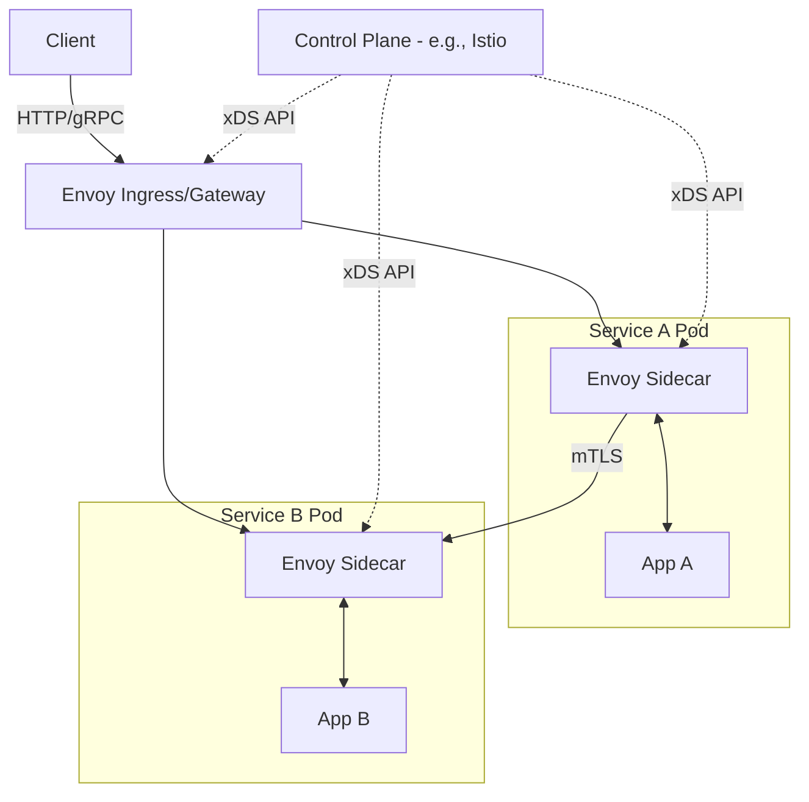

# Envoy Proxy

## История (Боль и Решение)
**Боль:** В микросервисной архитектуре сервисы написаны на разных языках, и реализовывать в каждом из них логику retries, timeouts, circuit breaking, observability и TLS-шифрования — это дублирование кода, высокий риск ошибок и ад в поддержке.
**Решение:** Вынести всю сетевую логику L4/L7 в отдельный sidecar-контейнер. Envoy, написанный на C++, работает как универсальный data plane, беря на себя все сетевые взаимодействия, предоставляя богатую телеметрию и динамическую конфигурацию через xDS API.

## Архитектура



## Пример конфигурации (envoy.yaml)
Статическая конфигурация роутинга (чаще генерируется динамически через xDS):
```yaml
static_resources:
  listeners:
  - name: listener_0
    address:
      socket_address: { address: 0.0.0.0, port_value: 8080 }
    filter_chains:
    - filters:
      - name: envoy.filters.network.http_connection_manager
        typed_config:
          "@type": type.googleapis.com/envoy.extensions.filters.network.http_connection_manager.v3.HttpConnectionManager
          stat_prefix: ingress_http
          route_config:
            name: local_route
            virtual_hosts:
            - name: backend
              domains: ["*"]
              routes:
              - match: { prefix: "/" }
                route: { cluster: service_backend }
          http_filters:
          - name: envoy.filters.http.router
  clusters:
  - name: service_backend
    connect_timeout: 0.25s
    type: STRICT_DNS
    lb_policy: ROUND_ROBIN
    load_assignment:
      cluster_name: service_backend
      endpoints:
      - lb_endpoints:
        - endpoint:
            address:
              socket_address: { address: backend-service, port_value: 80 }
```

## Day 2 Operations (Советы)
- **Мониторинг:** Включите `/stats/prometheus`. Метрики Envoy (например, `envoy_cluster_upstream_cx_active`, `envoy_http_downstream_rq_xx`) критичны для понимания здоровья сети и задержек.
- **Логирование:** Настройте Access Logs с нужным форматом (JSON) для сбора трейсов и добавления Trace ID. Контролируйте объем логов.
- **Тюнинг таймаутов:** Настраивайте глобальные таймауты и circuit breakers (max_connections, max_pending_requests), чтобы защитить бекенды от каскадных сбоев.
- **Динамическая конфигурация:** В production используйте Management Server (xDS), а не статические файлы, чтобы избежать рестартов при изменениях маршрутов.

## Антипаттерны
- **Envoy как монолитный балансировщик:** Использование огромного статического файла конфигурации руками без Control Plane.
- **Отсутствие лимитов:** Запуск sidecar-контейнеров без CPU/Memory limits, что может привести к OOM (особенно при большом количестве маршрутов).
- **Игнорирование телеметрии:** Использование Envoy только для маршрутизации, без сбора трейсов (Jaeger/Zipkin) и метрик.
- **Слепая вера в retry:** Настройка агрессивных retry без circuit breaking (может легко задосить собственные полуживые сервисы).
