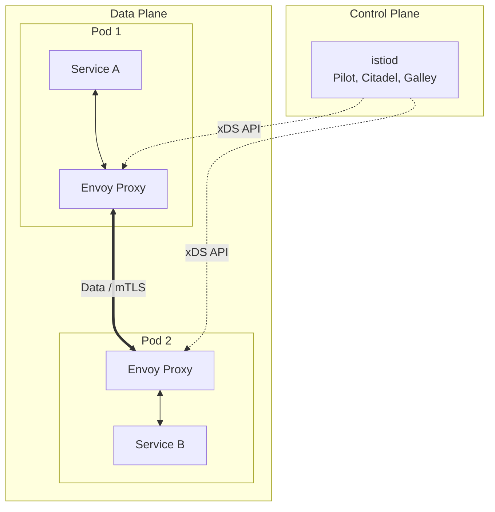

# Istio

## Боль и решение (DevOps-история)

**Боль:** В production-среде Kubernetes наступил хаос. Выкатывать новые версии сервисов страшно из-за отсутствия механизма Canary-релизов (встроенный Ingress и Deployment этого не умеют из коробки). Служба безопасности требует строгого mTLS между всеми сервисами и прозрачного аудита сетевых доступов, а разработчикам нужны распределенные трейсы и метрики L7 (HTTP статусы) без изменения кода каждого из сотен микросервисов. 

**Решение:** Внедрение **Istio**. Он использует легковесный прокси Envoy в качестве Data Plane (внедряется как sidecar) и `istiod` в качестве Control Plane. Istio берет на себя управление трафиком (маршрутизация на основе заголовков, весов), безопасность (автоматическая ротация mTLS сертификатов, авторизация) и наблюдаемость (экспорт метрик и трейсов).

## Архитектура Istio



## Примеры

**Bash: Добавление лейбла для инъекции Istio Envoy**
```bash
kubectl label namespace my-app istio-injection=enabled
```

**YAML: Canary релиз с помощью VirtualService (90% трафика на v1, 10% на v2)**
```yaml
apiVersion: networking.istio.io/v1beta1
kind: VirtualService
metadata:
  name: reviews-route
spec:
  hosts:
  - reviews.my-app.svc.cluster.local
  http:
  - route:
    - destination:
        host: reviews.my-app.svc.cluster.local
        subset: v1
      weight: 90
    - destination:
        host: reviews.my-app.svc.cluster.local
        subset: v2
      weight: 10
```

**YAML: DestinationRule для определения subsets (v1 и v2)**
```yaml
apiVersion: networking.istio.io/v1beta1
kind: DestinationRule
metadata:
  name: reviews-destination
spec:
  host: reviews.my-app.svc.cluster.local
  subsets:
  - name: v1
    labels:
      version: v1
  - name: v2
    labels:
      version: v2
```

## Советы Day 2 operations

1. **Обновления через ревизии (Revisions):** Никогда не обновляйте Istio in-place. Устанавливайте новую версию `istiod` с новым тегом ревизии (например, `istio.io/rev=1-18`), переводите часть namespace'ов на эту ревизию, перезапускайте поды и тестируйте.
2. **Ограничение конфигурации (Sidecar resource):** По умолчанию каждый Envoy получает конфигурацию обо ВСЕХ сервисах в кластере (что ведет к OOM). Обязательно используйте ресурс `Sidecar`, чтобы ограничить видимость (`egress`) только теми сервисами, с которыми реально общается приложение.
3. **Тюнинг Envoy:** Настройте `proxy.istio.io/config` аннотации для ограничения concurrency и оптимизации потребления ресурсов под высоконагруженные сервисы.
4. **Анализ конфигурации:** Используйте команду `istioctl analyze` и `istioctl proxy-config` для дебага проблем с маршрутизацией, чтобы понять, что реально применилось на Envoy.

## Антипаттерны

- **Istio только ради Ingress:** Установка всего тяжелого Control Plane Istio только для того, чтобы использовать Istio Ingress Gateway. Если нужен только продвинутый Ingress, лучше взять Envoy Gateway или Ingress Nginx.
- **Игнорирование NetworkPolicies:** Использование только Istio `AuthorizationPolicy` для изоляции сети. Лучшая практика — защита в глубину: Kubernetes NetworkPolicies для L3/L4 + Istio AuthPolicy для L7.
- **Отказ от Health-чеков Kubernetes:** Перекладывание всех проверок доступности на Envoy. Приложения всё ещё должны реализовывать качественные Liveness/Readiness пробы.
