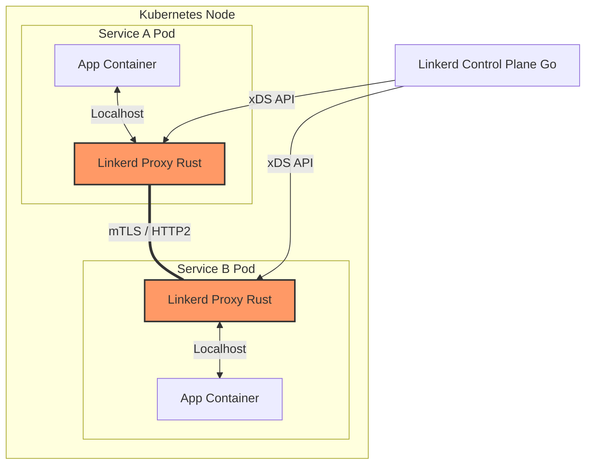

# Linkerd

## 📖 DevOps-история (Боль и Решение)

**Боль:** Ваша микросервисная архитектура разрослась, и вам потребовались mTLS, observability и traffic management. Вы установили Istio, но он оказался слишком тяжелым: потребляет кучу CPU/RAM, сложен в настройке, а его CRD-манифесты пугают команду разработки.

**Решение:** **Linkerd** — ультра-легковесный, быстрый и простой Service Mesh, созданный специально для Kubernetes. Его data plane (прокси) написан на Rust (микро-прокси `linkerd2-proxy`), что делает его невероятно быстрым и безопасным, потребляющим минимум ресурсов. Он работает по принципу "установил и забыл", предоставляя mTLS из коробки без сложных конфигураций.

---

## 🏗 Архитектура (Mermaid)



---

## 💻 Примеры (Bash / YAML)

### Установка и проверка
Linkerd славится своим CLI. Проверка кластера перед установкой и сама установка занимают минуты.

```bash
# 1. Проверка готовности кластера
linkerd check --pre

# 2. Установка Control Plane
linkerd install --crds | kubectl apply -f -
linkerd install | kubectl apply -f -

# 3. Проверка успешной установки
linkerd check
```

### Инъекция Sidecar-прокси (Меш сервиса)
Чтобы добавить сервис в Mesh, достаточно добавить аннотацию.

```yaml
apiVersion: apps/v1
kind: Deployment
metadata:
  name: my-service
spec:
  template:
    metadata:
      annotations:
        linkerd.io/inject: enabled # <-- Магия происходит здесь
    spec:
      containers:
      - name: my-app
        image: my-company/my-app:1.0
```

---

## 🛠 Day 2 Operations (Советы по эксплуатации)

1. **Linkerd Viz для Observability:** Установите расширение `linkerd-viz` (`linkerd viz install | kubectl apply -f -`). Оно предоставляет готовые дашборды Grafana и инструмент командной строки `linkerd viz stat` для мониторинга золотых сигналов (RPS, Latency, Error Rate).
2. **Ротация сертификатов:** Linkerd автоматически управляет сертификатами data plane (действуют 24 часа). Однако корневой сертификат (Trust Anchor) и сертификат издателя (Issuer) требуют управления. Используйте `cert-manager` для автоматической ротации Issuer сертификата.
3. **High Availability (HA):** В production всегда устанавливайте Linkerd с флагом `--ha` или используйте HA values в Helm, чтобы запустить несколько реплик Control Plane и настроить PodDisruptionBudgets.

---

## 🚫 Антипаттерны

1. **Использование Linkerd как Ingress-контроллера (API Gateway):** Linkerd — это Service Mesh (East-West трафик). Не пытайтесь сделать из него Edge Router (North-South). Правильный паттерн: использовать Ingress (например, Nginx или Emissary-ingress) и инжектировать прокси Linkerd в сам Ingress-контроллер.
2. **Игнорирование мониторинга Control Plane:** Легковесность не означает бессмертие. Обязательно настройте алерты на компоненты `linkerd-destination` и `linkerd-identity`.
3. **Ручная генерация и хранение сертификатов в Git:** Не храните долгоживущие корневые сертификаты Linkerd в открытом виде в репозиториях. Используйте Vault или SOPS для секретов.
