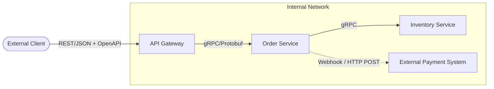

# OpenAPI, gRPC, Webhooks

## 📖 История: От хаоса интеграций к строгим контрактам

**Боль:** 
Микросервисы общались через REST, но документация велась в Confluence и вечно устаревала. Разработчики тратили дни, выясняя, какие поля ожидает соседний сервис. Межсервисное взаимодействие было медленным из-за накладных расходов JSON/HTTP1.1, а для получения обновлений клиенты использовали неэффективный Polling (постоянный опрос базы).

**Решение:**
1. **OpenAPI (Swagger):** Контракты стали кодом. Клиенты генерируются автоматически.
2. **gRPC:** Для высоконагруженного межсервисного общения (бинарный протокол, мультиплексирование).
3. **Webhooks:** Вместо поллинга сервисы сами уведомляют друг друга о событиях (Event-Driven push).

## 🗺️ Архитектура контрактов и связи



## 💻 Примеры

### OpenAPI (фрагмент спецификации)
```yaml
openapi: 3.0.0
info:
  title: Order API
  version: 1.0.0
paths:
  /orders:
    post:
      summary: Create a new order
      requestBody:
        required: true
        content:
          application/json:
            schema:
              type: object
              properties:
                item_id:
                  type: integer
```

### gRPC / Protobuf
```protobuf
syntax = "proto3";
package orders;

service OrderService {
  rpc CreateOrder (OrderRequest) returns (OrderResponse) {}
}

message OrderRequest {
  int32 item_id = 1;
  int32 quantity = 2;
}
message OrderResponse {
  string status = 1;
}
```

## 🛠️ Day 2 Operations (Эксплуатация)

1. **Стратегия версионирования:** Всегда поддерживайте две версии API при внедрении ломающих изменений. Старая версия должна работать до тех пор, пока метрики не покажут 0 запросов.
2. **Безопасность Webhooks:** Обязательно валидируйте входящие вебхуки (например, через HMAC подписи), чтобы избежать спуфинга событий. Задайте жесткие таймауты на отправку вебхуков, чтобы медленный получатель не исчерпал ваши воркеры.
3. **Observability gRPC:** Внедрите интерцепторы (interceptors) для gRPC для автоматического логирования, трейсинга и сбора метрик каждого вызова.

## 🚫 Антипаттерны

- **Ломающие изменения (Breaking Changes):** Изменение типа поля в API без смены мажорной версии.
- **Бесконечный Polling вместо Webhooks/Events:** Опрос статуса каждую секунду, когда статус меняется раз в сутки, сжигает ресурсы сети и БД.
- **Гигантские Payload'ы в gRPC:** Попытка передать мегабайты данных в одном RPC-вызове вместо использования streaming-возможностей gRPC.
