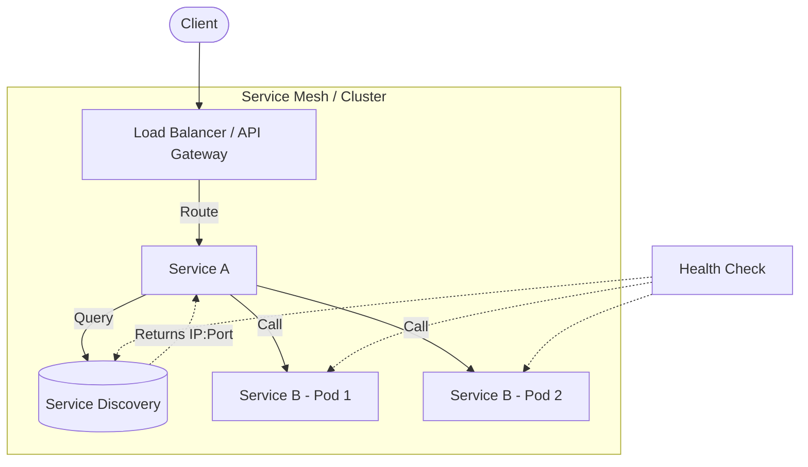

# Service Discovery и Load Balancing

## 📖 История: От хардкода к динамике

**Боль:** 
В начале пути сервисы общались друг с другом по захардкоженным IP-адресам. При каждом деплое или падении инстанса приходилось вручную обновлять конфиги. Балансировка нагрузки заключалась в Round-Robin DNS, который кэшировался клиентами, что приводило к отправке трафика на мертвые узлы.

**Решение:**
Внедрение Service Discovery (например, Consul или встроенный Kubernetes DNS) и умных балансировщиков (Envoy, HAProxy). Теперь сервисы регистрируются автоматически, а Load Balancer маршрутизирует трафик только на здоровые инстансы, учитывая их загрузку и доступность.

## 🗺️ Архитектура



## 💻 Примеры

### Kubernetes Service (Service Discovery + L4 Load Balancing)

```yaml
apiVersion: v1
kind: Service
metadata:
  name: backend-service
spec:
  selector:
    app: backend
  ports:
    - protocol: TCP
      port: 80
      targetPort: 8080
  type: ClusterIP
```

### Проверка DNS (Bash)
```bash
# Внутри пода проверяем, как резолвится сервис
nslookup backend-service.default.svc.cluster.local
```

## 🛠️ Day 2 Operations (Эксплуатация)

1. **Мониторинг кэшей DNS:** Убедитесь, что приложения корректно обрабатывают TTL (Time To Live) DNS-записей. В Java, например, DNS может кэшироваться вечно по умолчанию.
2. **Graceful Shutdown:** Настройте приложения на корректное завершение работы. Они должны сначала исключить себя из Service Discovery, дождаться завершения текущих запросов, и только потом выключаться.
3. **Health Checks:** Настройте агрессивные проверки `readiness` и `liveness`, чтобы трафик моментально переставал идти на зависшие узлы.

## 🚫 Антипаттерны

- **Игнорирование Health Checks:** Регистрация сервиса в Service Discovery до того, как он реально готов принимать трафик (например, база данных еще не инициализирована).
- **Слишком долгий DNS TTL:** Приводит к тому, что при изменении топологии клиенты продолжают стучаться в старые инстансы.
- **Client-side балансировка без обновлений:** Если клиент один раз получает список IP и не опрашивает Service Discovery регулярно, он не узнает о новых добавленных инстансах (scale-out).
