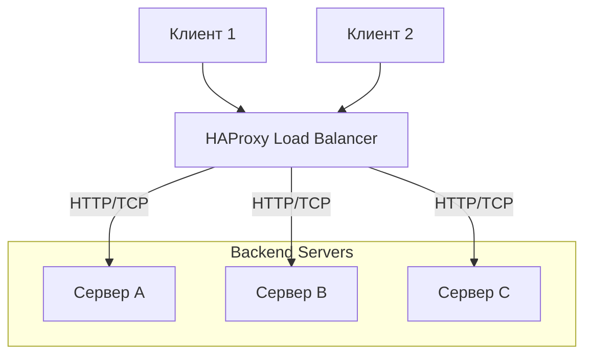

# HAProxy

## 📖 История (Боль и Решение)
**Боль:** Традиционные веб-серверы (например, ранние версии Nginx или Apache) не справлялись с высоконагруженным TCP/HTTP балансированием без потери производительности, а их встроенные механизмы проверки работоспособности бэкендов (health checks) были ограничены или требовали сторонних модулей.
**Решение:** HAProxy был создан как специализированный, ультра-быстрый и надежный балансировщик нагрузки. Он решает проблему распределения трафика (L4/L7) с минимальными задержками, предлагая продвинутые health checks и подробную статистику "из коробки".

## 📊 Архитектура (Mermaid)


## 🛠️ Примеры

**Пример `haproxy.cfg` (L7 балансировка с Health Check):**
```cfg
global
    log /dev/log local0
    maxconn 4096
    user haproxy
    group haproxy

defaults
    log global
    mode http
    option httplog
    option dontlognull
    timeout connect 5000
    timeout client  50000
    timeout server  50000

frontend http_front
    bind *:80
    default_backend web_servers

backend web_servers
    balance roundrobin
    option httpchk GET /health
    server web1 10.0.0.1:8080 check inter 2000 rise 2 fall 3
    server web2 10.0.0.2:8080 check inter 2000 rise 2 fall 3
```

## ⚙️ Day 2 Operations
- **Hitless Reloads:** Используйте `haproxy -W -f /etc/haproxy/haproxy.cfg -p /run/haproxy.pid -sf $(cat /run/haproxy.pid)` для перезагрузки конфигурации без сброса активных соединений.
- **Мониторинг:** Включите встроенную страницу `stats` или экспортер Prometheus. Тщательно следите за метриками `session rate`, `queue length` и `error rates`.
- **Логирование:** Выносите логи HAProxy через `rsyslog` или `syslog-ng` на отдельный сервер, так как при высоких нагрузках I/O локального диска может стать узким местом.

## 🚫 Антипаттерны
- **Использование HAProxy как веб-сервера:** HAProxy — это балансировщик и прокси, а не сервер статических файлов. Не пытайтесь заставить его отдавать картинки или CSS.
- **Сложная бизнес-логика в конфигурации:** Перегрузка HAProxy сотнями ACL-правил для маршрутизации (особенно с тяжелыми регулярными выражениями) сильно бьет по CPU.
- **Игнорирование Keep-Alive:** Отключение keep-alive соединений между HAProxy и бэкендами приводит к истощению TCP-портов (TIME_WAIT) при высоких нагрузках.
