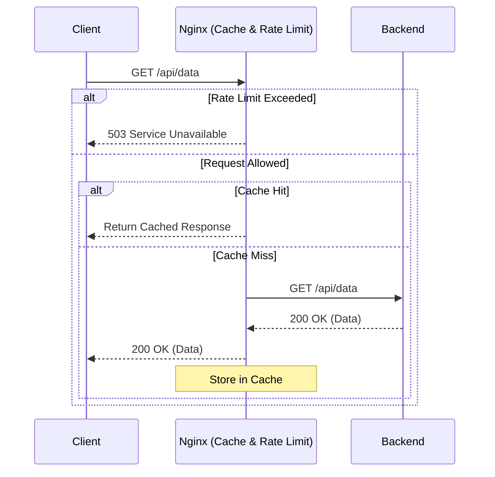

# Caching и Rate Limiting в Nginx

## 📖 История из окопов (Боль и Решение)

**Боль:** После запуска маркетинговой кампании трафик на сайт вырос в 10 раз. Бекэнд (Node.js/Python) не справился с нагрузкой, CPU улетел в 100%, база данных начала тормозить. Пользователи получали 503 или ждали загрузки по минуте.
**Решение:** Включение кэширования статики и тяжелых, но редко меняющихся ответов API на уровне Nginx, а также настройка Rate Limiting для защиты от парсеров и DDoS. Нагрузка на бекэнд упала на 80%, время ответа вернулось к миллисекундам.

## 📊 Архитектура



## 💻 Примеры конфигурации

### Nginx.conf (Caching & Rate Limiting)

```nginx
http {
    # Настройка кэша: путь, ключи, размер зоны в памяти и лимит на диске
    proxy_cache_path /var/cache/nginx levels=1:2 keys_zone=my_cache:10m max_size=10g inactive=60m use_temp_path=off;

    # Настройка Rate Limiting: 10 запросов в секунду с одного IP
    limit_req_zone $binary_remote_addr zone=mylimit:10m rate=10r/s;

    server {
        listen 80;
        server_name example.com;

        location /api/ {
            # Применяем Rate Limiting: разрешаем всплеск до 20 запросов без задержки
            limit_req zone=mylimit burst=20 nodelay;
            limit_req_status 429; # Возвращаем 429 Too Many Requests вместо 503

            # Применяем кэширование
            proxy_cache my_cache;
            proxy_cache_valid 200 302 10m;
            proxy_cache_valid 404 1m;
            
            # Отдаем кэш, если бекэнд упал или обновляется
            proxy_cache_use_stale error timeout updating http_500 http_502 http_503 http_504;
            
            # Добавляем заголовок для отладки
            add_header X-Cache-Status $upstream_cache_status;

            proxy_pass http://backend_upstream;
        }
    }
}
```

## 🛠 Day 2 Operations (Эксплуатация)

- **Мониторинг Cache Hit Ratio:** Собирайте метрику `$upstream_cache_status` (HIT, MISS, BYPASS, EXPIRED) в Prometheus через Nginx Exporter или логи. Если Hit Ratio низкий — нужно тюнить ключи кэширования (`proxy_cache_key`).
- **Тюнинг Burst:** Rate limit без `burst` и `nodelay` может блокировать нормальных пользователей при загрузке страницы со множеством ресурсов.
- **Инвалидация кэша:** Заранее продумайте, как сбрасывать кэш при релизах. Либо используйте коммерческий Nginx Plus (PURGE), либо модуль `nginx-cache-purge`, либо банальный `rm -rf /var/cache/nginx/*` (в крайнем случае).
- **Ротация логов Rate Limit:** Следите за логами `error.log`, куда пишутся события срабатывания лимитов, чтобы вовремя замечать ложноположительные блокировки.

## ⚠️ Антипаттерны

- **Кэширование сессионных данных:** Кэширование ответов с заголовками `Set-Cookie` или данных, зависящих от авторизации. Это может привести к тому, что один пользователь увидит приватные данные другого.
- **Отсутствие лимитов на кэш на диске:** Если не задать `max_size` в `proxy_cache_path`, кэш может занять весь диск, что приведет к падению сервера.
- **Слишком агрессивный Rate Limit:** Использование лимитов вроде `1r/s` без `burst` для API, к которому фронтенд делает несколько параллельных запросов.
- **Использование `$remote_addr` за балансировщиком:** Если Nginx стоит за AWS ALB или Cloudflare, лимитить нужно по `$http_x_forwarded_for`, иначе заблокируете всех, так как IP будет принадлежать балансировщику.
