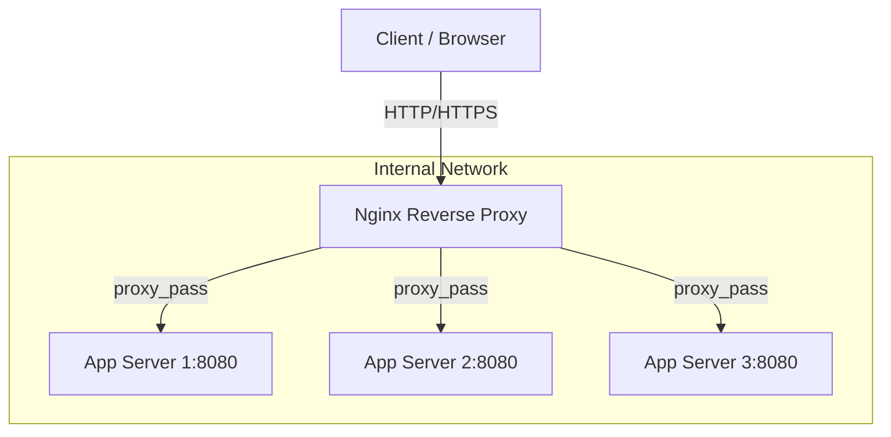

# Reverse Proxy и Load Balancing в Nginx

## История (Боль и Решение)
**Боль:** Сервисы разрастались, и клиенты начали стучаться напрямую к микросервисам. Это привело к проблемам с безопасностью (порты торчат наружу), CORS-адом на фронтенде и перегрузке отдельных узлов, когда трафик распределялся неравномерно.
**Решение:** Внедрение Nginx в качестве единой точки входа (Reverse Proxy) и балансировщика нагрузки (Load Balancer). Nginx принял на себя маршрутизацию по URL и распределение трафика между бэкендами, скрыв внутреннюю топологию от внешнего мира.

## Архитектура


## Пример конфигурации (nginx.conf)

```nginx
# Определение пула бэкендов
upstream backend_servers {
    # Алгоритмы: round-robin (default), least_conn, ip_hash
    least_conn; 
    
    server 10.0.0.11:8080 max_fails=3 fail_timeout=10s;
    server 10.0.0.12:8080 max_fails=3 fail_timeout=10s;
    server 10.0.0.13:8080 backup; # Используется, если остальные упали
    
    # Важно для производительности
    keepalive 32; 
}

server {
    listen 80;
    server_name api.example.com;

    location / {
        proxy_pass http://backend_servers;
        
        # Передача оригинальных заголовков бэкенду
        proxy_set_header Host $host;
        proxy_set_header X-Real-IP $remote_addr;
        proxy_set_header X-Forwarded-For $proxy_add_x_forwarded_for;
        proxy_set_header X-Forwarded-Proto $scheme;
        
        # Настройки keepalive соединений с бэкендом
        proxy_http_version 1.1;
        proxy_set_header Connection "";
    }
}
```

## Day 2 Operations (Эксплуатация)
- **Мониторинг Upstream:** Следите за метриками 502/504 ошибок. Если они растут — бэкенды не справляются или отваливаются по таймауту.
- **Таймауты:** Настройте `proxy_connect_timeout`, `proxy_send_timeout`, и `proxy_read_timeout` в соответствии с реальным временем ответа ваших сервисов, чтобы Nginx не держал мертвые соединения бесконечно.
- **Динамическое обновление (Open Source):** Изменение `upstream` требует `nginx -s reload`. Если бэкенды меняются каждую секунду (например, в Kubernetes), используйте Ingress-контроллеры, которые обновляют конфигурацию через Lua (например, Ingress-Nginx) или переходите на Envoy.

## Антипаттерны
- **Отсутствие Keepalive к апстримам:** Каждый запрос к бэкенду открывает новый TCP-хэндшейк. Это приводит к исчерпанию эфемерных портов (TIME_WAIT) и задержкам. Обязательно используйте `keepalive` в блоке `upstream` + `proxy_http_version 1.1;` + `proxy_set_header Connection "";`.
- **Игнорирование X-Forwarded-For:** Бэкенды будут думать, что все запросы приходят от IP-адреса балансировщика, что сломает rate-limiting и аналитику на стороне приложения.
- **Слепая вера в Round-Robin:** Если запросы сильно различаются по тяжести, Round-Robin приведет к тому, что один сервер будет загружен на 100%, а другой на 10%. Используйте `least_conn`.
