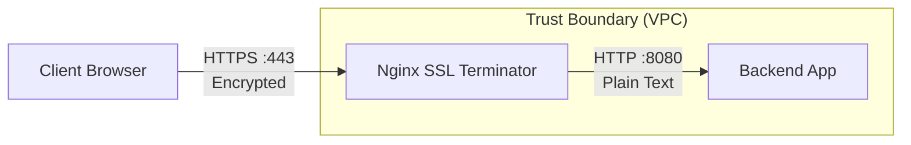

# SSL/TLS в Nginx

## История (Боль и Решение)
**Боль:** Трафик приложения передавался по чистому HTTP. Браузеры начали помечать сайт как "Небезопасный", пароли пользователей передавались в открытом виде, а аудит безопасности (PCI-DSS) был с треском провален.
**Решение:** Внедрение SSL/TLS-терминации на уровне Nginx (Edge). Nginx принимает зашифрованный HTTPS-трафик, расшифровывает его и отправляет в локальную сеть до бэкендов обычный HTTP. Сертификаты автоматизированы через Let's Encrypt и Certbot.

## Архитектура (SSL Termination)


## Пример конфигурации (nginx.conf)

```nginx
# Перенаправление HTTP на HTTPS
server {
    listen 80;
    server_name example.com www.example.com;
    return 301 https://$host$request_uri;
}

server {
    listen 443 ssl http2;
    server_name example.com;

    # Пути к сертификатам (например, от Let's Encrypt)
    ssl_certificate /etc/letsencrypt/live/example.com/fullchain.pem;
    ssl_certificate_key /etc/letsencrypt/live/example.com/privkey.pem;

    # Современные настройки SSL (генератор Mozilla SSL Configuration)
    ssl_protocols TLSv1.2 TLSv1.3;
    ssl_prefer_server_ciphers off; # Полагаемся на приоритеты клиента в TLSv1.3
    ssl_ciphers ECDHE-ECDSA-AES128-GCM-SHA256:ECDHE-RSA-AES128-GCM-SHA256:ECDHE-ECDSA-AES256-GCM-SHA384:ECDHE-RSA-AES256-GCM-SHA384:ECDHE-ECDSA-CHACHA20-POLY1305:ECDHE-RSA-CHACHA20-POLY1305:DHE-RSA-AES128-GCM-SHA256:DHE-RSA-AES256-GCM-SHA384;

    # Оптимизация SSL (кэширование сессий)
    ssl_session_cache shared:MozSSL:10m; # 10MB хватит на ~40,000 сессий
    ssl_session_timeout 1d;
    ssl_session_tickets off;

    # HSTS (форсируем HTTPS на стороне клиента)
    add_header Strict-Transport-Security "max-age=63072000; includeSubDomains; preload" always;

    location / {
        proxy_pass http://127.0.0.1:8080;
    }
}
```

### Автоматизация (Bash / Cron)
Пример cron-задачи для автоматического обновления сертификатов Certbot:
```bash
# /etc/cron.d/certbot-renew
0 3 * * * root certbot renew --quiet --post-hook "systemctl reload nginx"
```

## Day 2 Operations (Эксплуатация)
- **Мониторинг сроков действия:** Даже если есть Certbot, настройте внешний мониторинг (например, Blackbox Exporter для Prometheus), который будет алертить за 14 дней до истечения сертификата. Cron-задачи иногда ломаются.
- **Проверка конфигурации:** Регулярно прогоняйте ваш домен через [SSL Labs](https://www.ssllabs.com/ssltest/) для получения оценки (стремитесь к A+).
- **HTTP/2 и HTTP/3:** Всегда включайте `http2` (или `http3`, если скомпилирован модуль QUIC) вместе с SSL, это значительно ускоряет загрузку статики за счет мультиплексирования.

## Антипаттерны
- **Поддержка TLS 1.0 и 1.1:** Эти протоколы устарели, уязвимы (POODLE, BEAST) и не соответствуют современным стандартам безопасности. Оставляйте только TLS 1.2 и 1.3.
- **Слабые шифры (Weak Ciphers):** Использование дефолтных шифров может позволить атаки с понижением уровня (downgrade attacks). Всегда используйте конфигурации от Mozilla (Mozilla SSL Configuration Generator).
- **Отсутствие HSTS:** Без заголовка `Strict-Transport-Security` злоумышленник может использовать атаку SSL Stripping (например, в публичном Wi-Fi), принудительно оставив клиента на HTTP-версии сайта до редиректа.
- **SSL Termination перед недоверенной сетью:** Расшифровывать трафик на балансировщике и отправлять его по HTTP через публичный интернет или чужой дата-центр — огромная дыра. Если трафик покидает защищенный периметр (VPC), используйте End-to-End Encryption (повторное шифрование до бэкенда).
