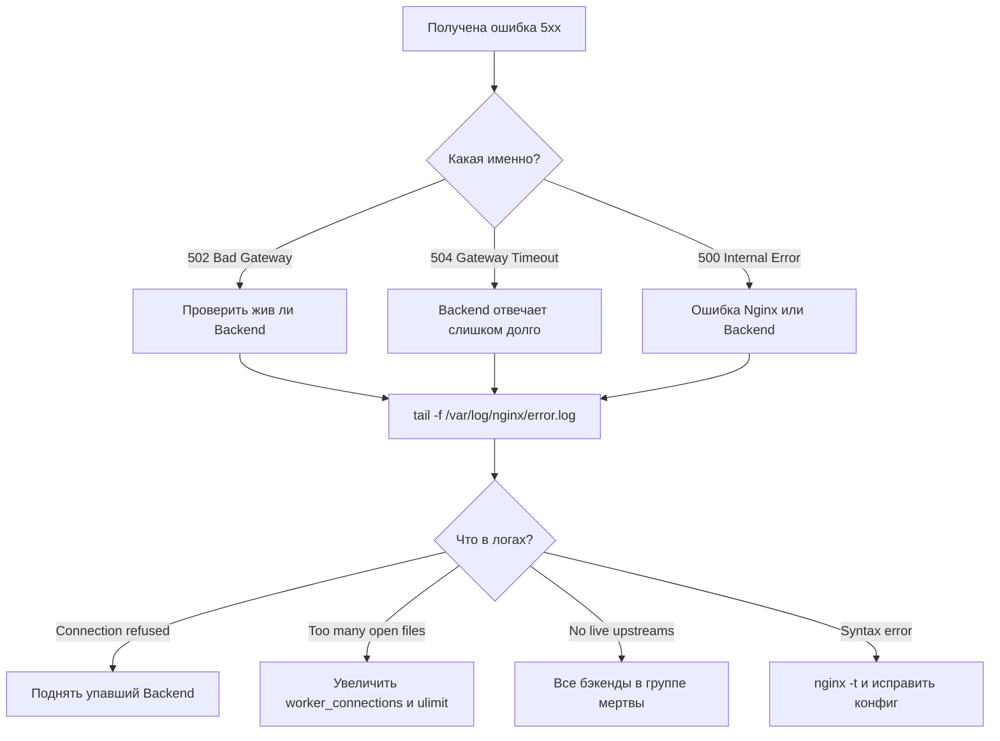

# Troubleshooting (Nginx)

## 📖 История из окопов (Боль и Решение)

**Боль:** Пятница вечер, мониторинг орет о 502 Bad Gateway на основном сайте. Первая мысль — "Упал Nginx!". Перезагрузка Nginx не помогает. Начинается паника, логи сканируются глазами, но там только "connection refused".
**Решение:** Понимание, что 502/504 — это почти всегда проблема не в Nginx, а в том, что за ним (backend). Систематический подход: проверка error.log Nginx -> проверка статуса апстрима -> проверка системных лимитов (OOM Killer, ulimit). В итоге оказалось, что бекэнд съел всю память и был убит системой.

## 📊 Алгоритм траблшутинга



## 💻 Инструменты и команды (Шпаргалка)

### Базовая диагностика

```bash
# 1. Проверка синтаксиса конфигурации (ВСЕГДА перед reload)
nginx -t

# 2. Мягкая перезагрузка без сброса соединений
nginx -s reload

# 3. Чтение ошибок в реальном времени
tail -f /var/log/nginx/error.log

# 4. Поиск конкретных ошибок (например, нехватка файловых дескрипторов)
grep "Too many open files" /var/log/nginx/error.log

# 5. Проверка, слушает ли Nginx нужные порты
ss -tlnp | grep nginx

# 6. Проверка текущих лимитов открытых файлов для процесса
cat /proc/$(cat /var/run/nginx.pid)/limits | grep "Max open files"
```

### Решение проблемы "Too many open files"
Если Nginx упирается в лимит соединений, нужно обновить конфиг:

```nginx
# В секции events
events {
    worker_connections 4096; # Увеличить (по умолчанию часто 512/1024)
}
# На уровне core
worker_rlimit_nofile 10000;
```
*Также не забудьте обновить системные лимиты (в systemd unit `LimitNOFILE=...`).*

## 🛠 Day 2 Operations (Эксплуатация)

- **Включите JSON логирование:** Парсить стандартный access.log больно. Переведите логи в JSON формат, это сильно упростит жизнь при отправке в ELK, Loki или Datadog.
- **Добавьте Request ID:** Настройте проброс `$request_id` на бекэнды. Это позволит отследить путь конкретного запроса от балансировщика до базы данных при разборе инцидентов.
- **Мониторинг через stub_status / Prometheus:** Включите `stub_status` и используйте Nginx Prometheus Exporter. Алерты на `nginx_up == 0` или резкий рост `nginx_connections_waiting` спасают до того, как пользователи начнут жаловаться.
- **Автоматизация CI/CD:** Никогда не правьте конфиги руками на сервере. Конфиг должен лежать в Git, а пайплайн должен обязательно делать `nginx -t` перед деплоем.

## ⚠️ Антипаттерны

- **Перезапуск (`systemctl restart`) вместо Reload (`nginx -s reload`):** Restart обрывает все текущие клиентские соединения. Reload запускает новые воркеры с новым конфигом и плавно завершает старые.
- **Игнорирование error.log:** Часто там копятся предупреждения (warnings), которые со временем превращаются в фатальные ошибки.
- **Ловля 502/504 на клиенте:** Если у вас таймауты, не пытайтесь просто увеличивать `proxy_read_timeout` до бесконечности. Это замаскирует проблему с тормозящим бекэндом и в итоге приведет к исчерпанию воркеров Nginx.
- **"Слепой" конфиг:** Копирование кусков конфигурации из StackOverflow без понимания того, что делает каждая директива (особенно опасно с rewrite-правилами и if-условиями в Nginx).
