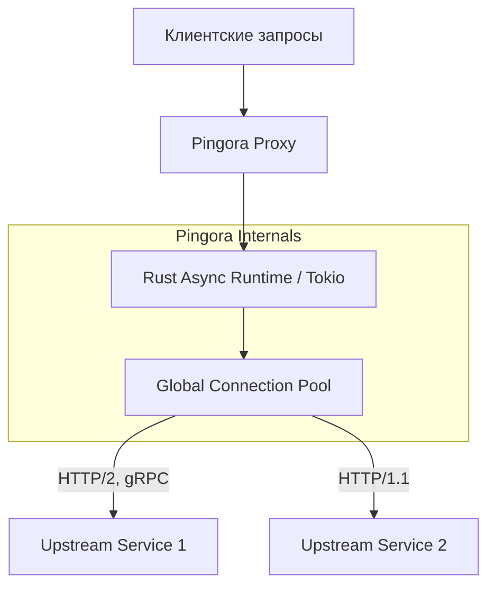

# Pingora (Современный Proxy на Rust)

## 📖 История (Боль и Решение)
**Боль:** Инженеры Cloudflare исторически использовали Nginx в качестве основного прокси. Со временем они столкнулись с архитектурными ограничениями Nginx (например, проблемы с распределением нагрузки между воркерами, неэффективное использование пула соединений) и проблемами безопасности памяти, присущими C.
**Решение:** Cloudflare разработала **Pingora** — асинхронный многопоточный фреймворк на Rust для создания HTTP-прокси. Rust обеспечил безопасность памяти "из коробки" (отсутствие segfaults), а новая архитектура позволила глобально шарить пулы соединений между потоками, кардинально снизив потребление CPU и памяти.

## 📊 Архитектура (Mermaid)


## 🛠️ Примеры

**Пример создания простого Load Balancer на Rust с использованием Pingora:**
```rust
use async_trait::async_trait;
use pingora::prelude::*;
use pingora::proxy::{ProxyHttp, Session};
use std::sync::Arc;

pub struct MyProxy {
    lb: Arc<LoadBalancer<RoundRobin>>,
}

#[async_trait]
impl ProxyHttp for MyProxy {
    type CTX = ();
    fn new_ctx(&self) -> () {}

    async fn upstream_peer(&self, _session: &mut Session, _ctx: &mut ()) -> Result<Box<HttpPeer>> {
        let upstream = self.lb.select(b"", 256).unwrap();
        // Настраиваем peer для подключения
        let peer = Box::new(HttpPeer::new(upstream, false, String::new()));
        Ok(peer)
    }
}

fn main() {
    let mut server = Server::new(None).unwrap();
    server.bootstrap();
    
    let mut upstreams = LoadBalancer::try_from_iter(["10.0.0.1:8080", "10.0.0.2:8080"]).unwrap();
    let proxy = MyProxy { lb: Arc::new(upstreams) };
    
    let mut proxy_service = http_proxy_service(&server.configuration, proxy);
    proxy_service.add_tcp("0.0.0.0:80");
    
    server.add_service(proxy_service);
    server.run_forever();
}
```

## ⚙️ Day 2 Operations
- **Graceful Restarts:** Pingora поддерживает передачу файловых дескрипторов (socket handover) новым процессам, что позволяет обновлять бинарник без потери активных соединений (Zero Downtime Upgrade).
- **Метрики и Трассировка:** Интеграция Prometheus метрик на уровне кода обязательна. Так как Pingora — это фреймворк, вам нужно явно описывать экспорт метрик latency, ошибок и состояния пулов соединений.
- **Тюнинг Tokio:** Производительность Pingora сильно зависит от настроек асинхронного рантайма Tokio. Не забывайте мониторить загрузку потоков рантайма и блокирующие операции.

## 🚫 Антипаттерны
- **Использование для простых задач:** Использовать Pingora для банальной отдачи пары статических файлов — это оверинжиниринг. Для этого лучше подойдет Nginx, Caddy или Traefik.
- **Блокирующий код:** Написание синхронного (блокирующего) кода внутри хендлеров Pingora убьет весь профит от использования асинхронного I/O.
- **Сборка монолита:** Попытка впихнуть сложную бизнес-логику внутрь прокси. Pingora должна заниматься маршрутизацией, балансировкой и модификацией заголовков, а не работой с базой данных.
