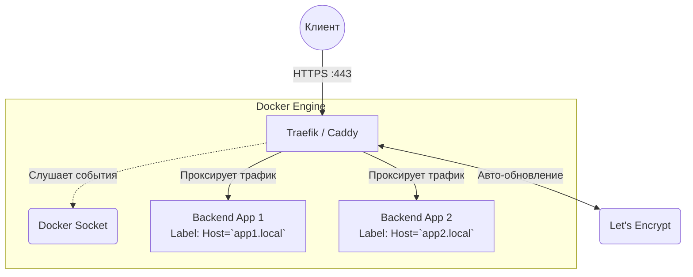

# Traefik и Caddy: Динамические балансировщики и авто-HTTPS

## 📖 История: Боль и Решение

**Боль:** В эпоху микросервисов и контейнеров (Docker, Kubernetes) приложения постоянно появляются и исчезают. Традиционные веб-серверы, такие как Nginx, требуют ручного обновления конфигурации и перезапуска (`reload`) при каждом добавлении нового контейнера. Кроме того, ручной выпуск и продление SSL-сертификатов Let's Encrypt — это лишняя рутина и риск забыть обновить сертификат.

**Решение:** **Traefik** и **Caddy** созданы для динамических сред. Они умеют автоматически находить новые сервисы (например, читая Docker labels или Kubernetes Ingress) и настраивать маршрутизацию на лету без перезагрузок. Главная филлерная фича обоих — встроенная, автоматическая поддержка HTTPS (Let's Encrypt), не требующая настройки cron-джобов или сторонних утилит (certbot).

## 🏗 Архитектура



## 🛠 Примеры (YAML / Caddyfile)

### Traefik: Настройка через Docker Compose (Labels)

Сам Traefik настраивается как контейнер, а маршруты для других сервисов задаются через метки (labels).

```yaml
# docker-compose.yml
version: '3'

services:
  traefik:
    image: traefik:v2.10
    command:
      - "--api.insecure=true" # Включаем дашборд (только для dev!)
      - "--providers.docker=true" # Слушаем Docker API
      - "--entrypoints.web.address=:80"
    ports:
      - "80:80"
      - "8080:8080" # Порт дашборда
    volumes:
      - "/var/run/docker.sock:/var/run/docker.sock:ro" # Обязательно для авто-дискавери

  my-app:
    image: nginx:alpine
    labels:
      # Говорим Traefik маршрутизировать трафик на этот контейнер
      - "traefik.enable=true"
      - "traefik.http.routers.myapp.rule=Host(`myapp.example.com`)"
      - "traefik.http.services.myapp.loadbalancer.server.port=80"
```

### Caddy: Лаконичный Caddyfile

Caddy славится своим невероятно простым синтаксисом конфигурации.

```caddyfile
# Caddyfile
myapp.example.com {
    # Caddy автоматически получит SSL-сертификат для этого домена
    reverse_proxy localhost:8080
}

static.example.com {
    root * /var/www/html
    file_server
}
```

## 🚀 Day 2 Operations (Жизнь после деплоя)

* **Хранение сертификатов:** При работе в кластере (например, Docker Swarm или Kubernetes) или нескольких репликах Traefik/Caddy, убедитесь, что хранилище сертификатов (например, `acme.json` в Traefik) смонтировано на надежный сетевой диск или используется Key-Value хранилище (Consul, etcd), чтобы не получать лимиты от Let's Encrypt при пересоздании подов.
* **Мониторинг:** Обязательно включите отдачу метрик в формате Prometheus. Для Traefik это флаг `--metrics.prometheus=true`. Следите за количеством 5xx ошибок и временем ответа бекендов.
* **Тюнинг таймаутов:** Настройте правильные таймауты между прокси и бекендами, иначе длительные WebSocket-соединения или тяжелые запросы будут обрываться.

## 💀 Антипаттерны

1. **Монтирование `docker.sock` в production без защиты:** Давать прямой доступ к сокету Docker — риск безопасности. Если Traefik взломают, хакер получит root-доступ к хосту. Лучше использовать Docker Socket Proxy (например, от Tecnativa), который ограничивает API только чтением событий (read-only).
2. **Игнорирование Rate Limits Let's Encrypt:** Если вы часто пересоздаете тестовое окружение и не кэшируете выданные сертификаты в volume, Let's Encrypt заблокирует вас на неделю за превышение лимитов (Too many certificates already issued for exact set of domains). В Dev-средах используйте Let's Encrypt Staging API (или локальный CA).
3. **Использование как замена CDN для статики:** Хотя Caddy умеет раздавать статику, для высоконагруженной отдачи медиафайлов лучше использовать Nginx или полноценный CDN. Traefik вообще задуман исключительно как edge-router/proxy, а не сервер статических файлов.
