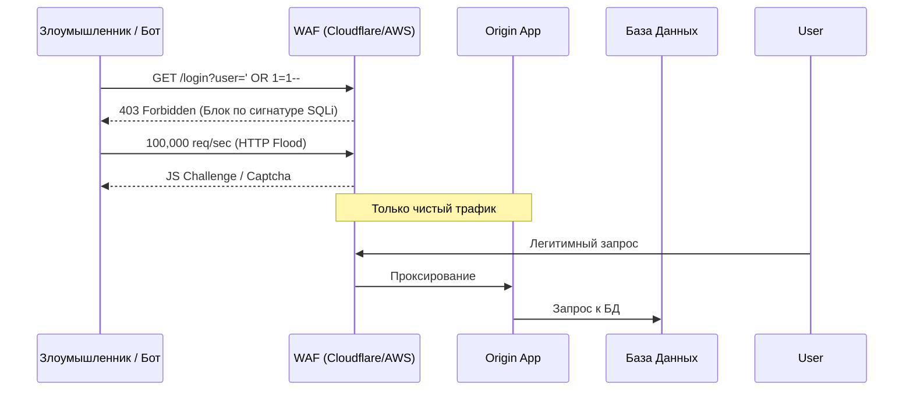

# WAF и DDoS защита

## 📖 DevOps-история (Боль и решение)
**Боль:** Сервис стал популярен, и в логи полетели подозрительные запросы вида `/?id=1' OR '1'='1` (SQL инъекции). Периодически ботнеты устраивают HTTP-флуд (Layer 7 DDoS), кладя базу данных из-за исчерпания пула соединений. Регулярные выражения в Nginx перестали справляться.
**Решение:** Установка WAF (Web Application Firewall) и системы защиты от DDoS (Cloudflare, AWS WAF). WAF анализирует каждый HTTP-запрос по сигнатурам OWASP Top 10, блокируя SQLi/XSS до того, как они дойдут до приложения. Система защиты от DDoS абсорбирует флуд, показывая подозрительным клиентам JS Challenge или капчу.

## 📊 Архитектура защиты



## 💻 Примеры

### AWS WAF Terraform Example (Блокировка по Rate Limit)
```hcl
resource "aws_wafv2_web_acl" "main" {
  name  = "rate-limit-waf"
  scope = "CLOUDFRONT"

  rule {
    name     = "RateLimitRule"
    priority = 1

    action {
      block {}
    }

    statement {
      rate_based_statement {
        limit              = 2000
        aggregate_key_type = "IP"
      }
    }

    visibility_config {
      cloudwatch_metrics_enabled = true
      metric_name                = "RateLimitRuleMetric"
      sampled_requests_enabled   = true
    }
  }
}
```

### Пример лога сработавшего WAF
```json
{
  "action": "BLOCK",
  "clientIp": "192.168.1.1",
  "ruleId": "942100",
  "ruleMessage": "SQL Injection Attack Detected via libinjection",
  "uri": "/api/v1/users?search=' UNION SELECT password FROM users"
}
```

## 🛠 Day 2 Operations (Советы)
* **Shadow/Log Mode:** При внедрении новых правил WAF всегда сначала включайте их в режиме логирования (Count/Log). Анализируйте логи неделю, исправляйте False Positives, и только потом переключайте в Block.
* **Тюнинг Rate Limiting:** Настраивайте разные лимиты для разных эндпоинтов. Для `/api/login` лимит должен быть жестким (например, 5 запросов в минуту), а для отдачи статики - свободным.
* **Защита Origin:** Ограничьте доступ к Origin серверу на уровне Security Groups / Firewall, чтобы принимать трафик *только* с IP-адресов вашего WAF провайдера. Иначе атакующий узнает ваш IP и будет бить напрямую в обход WAF.

## ⚠️ Антипаттерны
* **"Включил и забыл":** Приложения меняются (добавляются новые API, меняются форматы данных). Если не обновлять правила WAF, легитимные запросы начнут блокироваться (False Positives).
* **Блокировка по GeoIP без анализа:** Полная блокировка стран может привести к потере клиентов в отпуске или через корпоративные VPN. Лучше показывать им Challenge (капчу).
* **Слепая вера в Managed Rules:** Стандартные правила от провайдера не знают специфики вашего приложения. Например, WAF может заблокировать загрузку большого JSON-файла, посчитав его аномальным.
