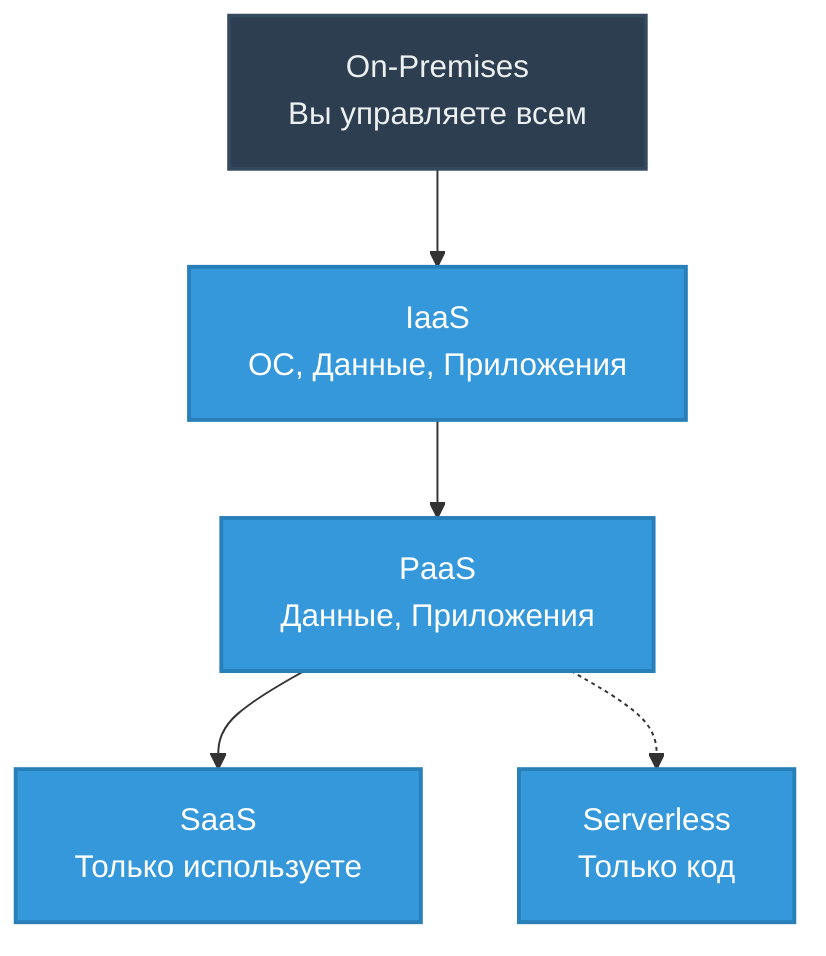

# Основы Cloud Computing (IaaS, PaaS, SaaS, Serverless)

## DevOps-история: Боль и Решение
**Боль:** В дата-центре закончилось место под новые сервера, закупка железа занимает 3 месяца, а разработчикам нужны среды прямо сейчас для запуска нового микросервисного приложения. Админы тонут в заявках на виртуалки и ручную настройку сетей.
**Решение:** Переход в облако (Cloud Computing). Предоставление ресурсов по требованию (On-Demand) через API. Команды сами поднимают IaaS/PaaS-ресурсы через Terraform за минуты, а не месяцы.

## Архитектура / Схема


## Примеры (Код/Конфиги)
**Пример IaaS (Terraform - AWS EC2):**
```hcl
resource "aws_instance" "web" {
  ami           = "ami-0c55b159cbfafe1f0"
  instance_type = "t3.micro"
  tags = {
    Name = "HelloWorld"
  }
}
```

**Пример Serverless (AWS Lambda - Python):**
```python
import json

def lambda_handler(event, context):
    return {
        'statusCode': 200,
        'body': json.dumps('Hello from Serverless!')
    }
```

## Day 2 Operations (Советы)
- **Управление затратами (FinOps):** Обязательно тегируйте все ресурсы (Environment, Owner, Project, CostCenter) для точного биллинга.
- **Мониторинг лимитов:** Облачные провайдеры имеют квоты (Soft/Hard limits) на ресурсы. Настройте автоматические алерты на приближение к лимитам (например, AWS Trusted Advisor).
- **Безопасность:** Используйте IAM-роли с минимальными привилегиями (Principle of Least Privilege). Никаких долгоживущих ключей (Access Keys) на виртуальных машинах.

## Антипаттерны
- **Lift-and-Shift без оптимизации:** Перенос "как есть" on-premise архитектуры (большие монолиты на гигантских виртуалках) в облако. Это обычно приводит к огромным счетам.
- **ClickOps:** Создание и изменение ресурсов через веб-консоль провайдера вместо использования Infrastructure as Code (Terraform/Pulumi).
- **Vendor Lock-in в простых вещах:** Использование проприетарных сервисов там, где легко можно было бы использовать открытые стандарты (например, проприетарные брокеры сообщений вместо управляемого Kafka).
