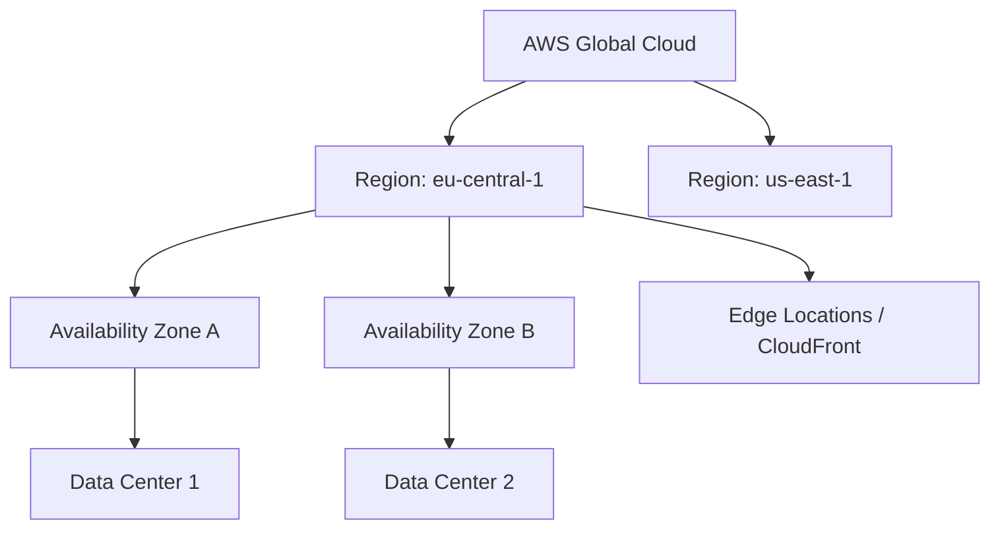

# 00 Основы AWS

## 📖 DevOps-история
**Боль:** Заказ и настройка физических серверов занимала месяцы. Когда трафик непредсказуемо рос, система падала от нехватки ресурсов. Приходилось содержать избыточный парк серверов, который простаивал 80% времени.
**Решение:** Переход на AWS. Инфраструктура стала кодом (API-driven), ресурсы масштабируются автоматически (Auto Scaling), а оплата идет только за фактическое использование (Pay-as-you-go). Сервера поднимаются за секунды.

## 🗺️ Архитектура (Global Infrastructure)



## 💻 Примеры

**Bash (AWS CLI) - Запуск инстанса:**
```bash
aws ec2 run-instances \
    --image-id ami-0c55b159cbfafe1f0 \
    --count 1 \
    --instance-type t3.micro \
    --key-name MyKeyPair \
    --security-group-ids sg-903004f8 \
    --subnet-id subnet-6e7f829e
```

**Terraform - Базовый VPC:**
```hcl
provider "aws" {
  region = "eu-central-1"
}

resource "aws_vpc" "main" {
  cidr_block           = "10.0.0.0/16"
  enable_dns_hostnames = true
  
  tags = {
    Name = "main-vpc"
    Environment = "production"
  }
}
```

## 🛠️ Day 2 Operations
- **Управление затратами:** Обязательно внедрите стратегию тегирования (Cost Allocation Tags: `Owner`, `Environment`, `Project`). Используйте AWS Cost Explorer и AWS Budgets для алертов о перерасходе.
- **Безопасность и комплаенс:** Включите AWS CloudTrail во всех регионах для аудита. Используйте AWS Config для отслеживания изменений конфигурации.
- **Оптимизация:** Регулярно проверяйте рекомендации AWS Trusted Advisor (cost, security, fault tolerance).

## ❌ Антипаттерны
- **ClickOps:** Создание инфраструктуры через веб-консоль (UI) вместо Infrastructure as Code (Terraform/CloudFormation).
- **Single AZ:** Размещение критичных сервисов только в одной Availability Zone.
- **Root Account:** Использование Root-аккаунта для повседневных задач или CI/CD.
- **Открытые Security Groups:** Использование `0.0.0.0/0` для SSH/RDP доступов.
