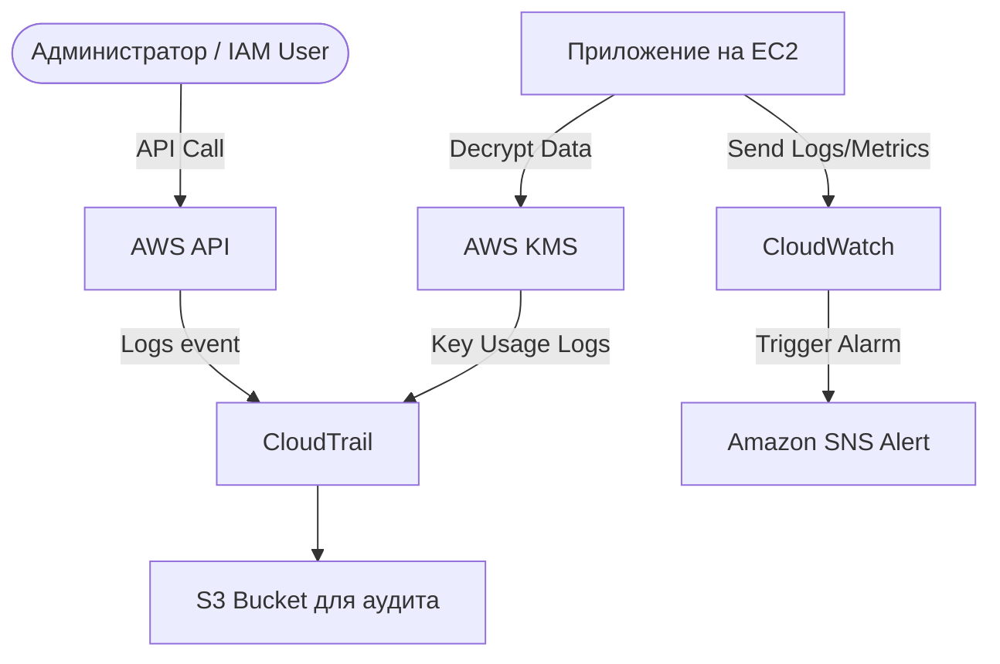

# AWS CloudWatch, CloudTrail, KMS

## 📖 DevOps-история (Боль и Решение)
**Боль:** Сервер упал посреди ночи, и никто не знает почему. Параллельно кто-то случайно удалил базу данных, а учетные данные оказались в открытом виде в логах. 
**Решение:** Настроить **CloudWatch** для сбора логов и метрик, использовать **CloudTrail** для аудита каждого API-вызова (чтобы найти "убийцу" базы) и внедрить **KMS** для шифрования секретов и данных "в покое" (at rest).

## 🏗 Архитектура



## 💻 Примеры

### AWS CLI: Создание KMS ключа и алиаса
```bash
# Создаем ключ
KEY_ID=$(aws kms create-key --description "My App Key" --query 'KeyMetadata.KeyId' --output text)

# Даем понятное имя (алиас)
aws kms create-alias --alias-name alias/myapp-key --target-key-id $KEY_ID
```

### Terraform: CloudWatch Log Group
```hcl
resource "aws_cloudwatch_log_group" "app_logs" {
  name              = "/ecs/myapp"
  retention_in_days = 14
  
  kms_key_id        = aws_kms_key.cloudwatch_key.arn
}
```

## 🛠 Day 2 Operations
- **Жизненный цикл данных:** Всегда настраивайте `Retention Policy` для CloudWatch Logs. По умолчанию логи хранятся бесконечно, сжирая бюджет.
- **Ротация ключей:** Включите автоматическую ротацию (Automatic Key Rotation) для KMS, это стоит копейки, но снимает вопросы у безопасников (compliance).
- **Оповещения:** Настройте CloudWatch Alarms на метрику ошибок `4xx/5xx` вашего балансировщика, а не только на CPU серверов.

## 🚫 Антипаттерны
- ❌ Хранение PII (персональных данных) или паролей в логах CloudWatch (KMS вас тут не спасет, если разработчик сделал `print(password)`).
- ❌ CloudTrail без включенного MFA Delete на S3-бакете, куда он пишет логи. Злоумышленник может удалить следы.
- ❌ Использование Customer Managed Keys (CMK) KMS там, где достаточно бесплатных AWS Managed Keys (AWS/S3, AWS/RDS), что приводит к лишним тратам.
