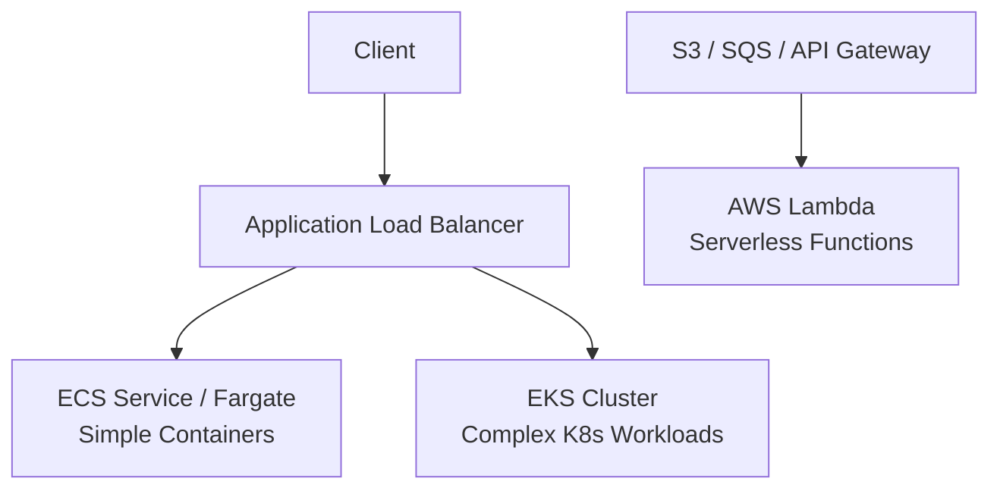

# AWS: Вычисления (EKS, ECS, Lambda)

## DevOps-история: Боль и Решение
**Боль**: Разработчики пишут микросервисы, а админы вручную раскатывают их на десятках EC2-инстансов. Зависимости конфликтуют, деплой занимает часы, а утилизация ресурсов серверов — около 15%.
**Решение**: Упаковка в Docker. Для простых веб-приложений и API без сложной оркестрации берем **ECS (Fargate)**. Для сложных систем, которым нужна экосистема Kubernetes (Helm, Istio), разворачиваем **EKS**. А для событийной логики (ресайз картинок, крон-джобы, вебхуки) переходим на **Lambda**, где платим только за миллисекунды выполнения.

## Архитектура


## Примеры (Terraform / YAML)

### ECS (Fargate) Service
```hcl
resource "aws_ecs_task_definition" "app" {
  family                   = "my-app"
  network_mode             = "awsvpc"
  requires_compatibilities = ["FARGATE"]
  cpu                      = 256
  memory                   = 512
  container_definitions = jsonencode([{
    name      = "web"
    image     = "nginx:alpine"
    essential = true
    portMappings = [{
      containerPort = 80
      hostPort      = 80
    }]
  }])
}
```

### Lambda (с API Gateway)
```hcl
resource "aws_lambda_function" "hello_world" {
  filename      = "function.zip"
  function_name = "hello_world"
  role          = aws_iam_role.lambda_exec.arn
  handler       = "index.handler"
  runtime       = "nodejs20.x"
}
```

## Day 2 Operations
- **EKS**:
  - Используйте **Karpenter** вместо стандартного Cluster Autoscaler для быстрого и дешевого скейлинга нод.
  - Обновляйте AMI worker-нод и версию Control Plane регулярно, K8s быстро устаревает.
- **ECS**:
  - Используйте **Fargate Spot** для некритичных воркеров (до 70% скидки).
  - Настройте ECS Exec для безопасного дебага внутри контейнера без SSH.
- **Lambda**:
  - Настройте **Provisioned Concurrency** для устранения Cold Starts на критичных эндпоинтах.
  - Собирайте логи централизованно, настройте алерты по метрикам `Errors` и `Throttles`.

## Антипаттерны
- **EKS**: Запускать EKS для 2-3 простых контейнеров (оверхед на поддержку K8s съест всю выгоду, используйте ECS). Вручную управлять нодами через SSH.
- **ECS**: Пытаться реализовать сложный Service Mesh своими силами (лучше App Mesh или переезд на EKS).
- **Lambda**: Запускать долгие процессы (более 15 минут) — Lambda просто упадет по таймауту. Писать "монолитные" лямбды (Fat Lambdas), загружая туда мегабайты ненужных библиотек, что сильно увеличивает Cold Start.
