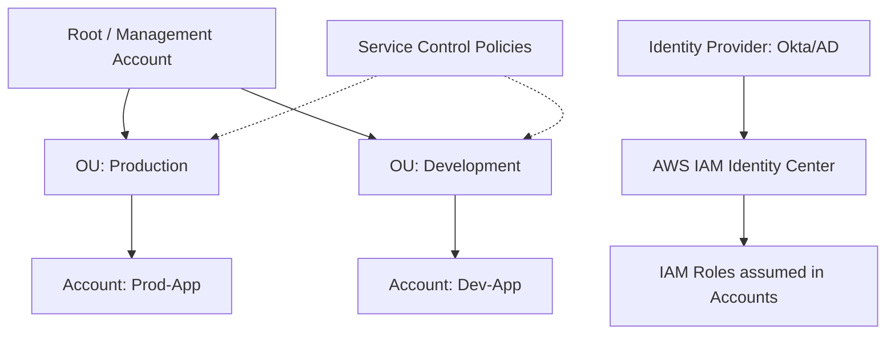

# IAM и AWS Organizations

## 📖 DevOps-история
**Боль:** В компании было 50 разработчиков, каждый создавал IAM Users прямо в production-аккаунте. Ключи доступа терялись, хардкодились в репозиториях, а уволенные сотрудники сохраняли доступ месяцами. Управление мульти-аккаунтной средой превратилось в хаос.
**Решение:** Внедрение AWS Organizations и IAM Identity Center (ex-SSO). Все учетные записи объединены в иерархию (OUs). Разработчики логинятся через корпоративный Google Workspace/Okta, получая временные токены к нужным аккаунтам. Доступы ограничены через SCP (Service Control Policies).

## 🗺️ Архитектура



## 💻 Примеры

**JSON - IAM Policy (Least Privilege):**
```json
{
  "Version": "2012-10-17",
  "Statement": [
    {
      "Effect": "Allow",
      "Action": [
        "s3:GetObject",
        "s3:PutObject"
      ],
      "Resource": "arn:aws:s3:::my-app-data-bucket/*"
    }
  ]
}
```

**Terraform - Service Control Policy (SCP) для защиты CloudTrail:**
```hcl
resource "aws_organizations_policy" "protect_cloudtrail" {
  name        = "ProtectCloudTrail"
  description = "Prevent disabling or modifying CloudTrail"
  content     = <<POLICY
{
  "Version": "2012-10-17",
  "Statement": [
    {
      "Effect": "Deny",
      "Action": [
        "cloudtrail:StopLogging",
        "cloudtrail:DeleteTrail",
        "cloudtrail:UpdateTrail"
      ],
      "Resource": "*"
    }
  ]
}
POLICY
}
```

## 🛠️ Day 2 Operations
- **Аудит доступов:** Используйте IAM Access Analyzer для выявления политик, дающих доступ извне аккаунта.
- **Очистка (Cleanup):** Настройте регулярную ротацию IAM Access Keys (если они все еще нужны) не реже раза в 90 дней. Удаляйте неиспользуемые роли.
- **Временные доступы:** Используйте AWS STS (Security Token Service) и assumed roles в CI/CD пайплайнах (OIDC) вместо статических ключей.

## ❌ Антипаттерны
- **Wildcards (`*`):** Использование `Action: "*"` или `Resource: "*"` в IAM политиках для сервисов.
- **IAM Users для людей:** Создание долгоживущих IAM Users для сотрудников вместо федерации (SSO/Identity Center).
- **Hardcoded Credentials:** Хранение `AWS_ACCESS_KEY_ID` в исходном коде или Dockerfile (всегда используйте роли инстансов/контейнеров).
- **Размытые границы:** Размещение Production и Dev ресурсов в одном AWS аккаунте вместо изоляции через AWS Organizations.
