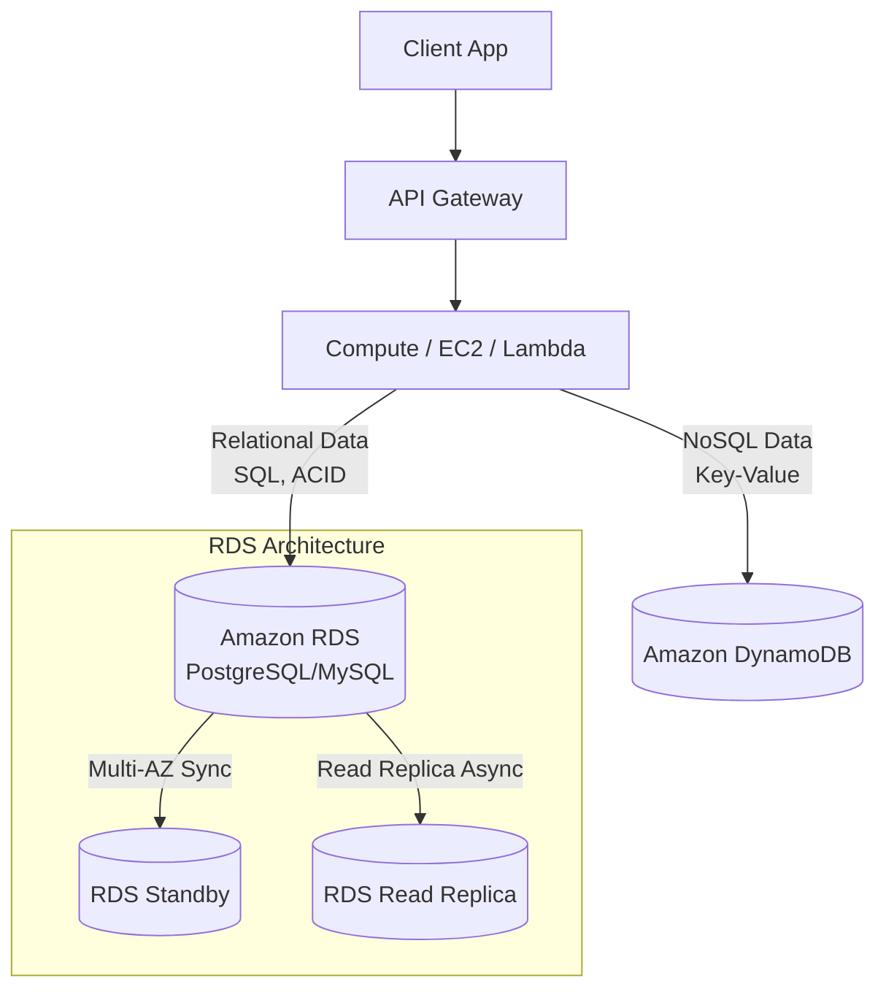

# AWS: Управляемые базы данных (RDS, DynamoDB)

## DevOps-история: Боль и Решение
**Боль**: Команда тратит дни на настройку репликации, бэкапов и патчинг PostgreSQL на EC2. При росте нагрузки диск переполняется, а база "ложится". Для высоконагруженного кэша пытались поднять кластер Redis, но запутались в шардировании.
**Решение**: Перенос реляционных баз в **RDS (или Aurora)**, где бэкапы, Multi-AZ и патчинг работают из коробки. Для NoSQL-нагрузок (key-value, документы) с непредсказуемым трафиком используется **DynamoDB**, которая масштабируется автоматически и не требует управления серверами.

## Архитектура


## Примеры (Terraform)

### RDS PostgreSQL
```hcl
resource "aws_db_instance" "default" {
  allocated_storage    = 20
  storage_type         = "gp3"
  engine               = "postgres"
  engine_version       = "15.4"
  instance_class       = "db.t4g.micro"
  identifier           = "mydb"
  username             = "dbadmin"
  password             = var.db_password
  parameter_group_name = "default.postgres15"
  skip_final_snapshot  = true
  multi_az             = true
  
  backup_retention_period = 7
}
```

### DynamoDB Table
```hcl
resource "aws_dynamodb_table" "users-session" {
  name           = "UserSessions"
  billing_mode   = "PAY_PER_REQUEST" # On-demand
  hash_key       = "SessionId"

  attribute {
    name = "SessionId"
    type = "S"
  }

  ttl {
    attribute_name = "TimeToExist"
    enabled        = true
  }
}
```

## Day 2 Operations
- **RDS**:
  - Настройте **Performance Insights** для анализа долгих запросов.
  - Используйте **Storage Auto Scaling**, чтобы база не упала от нехватки места.
  - Для Aurora используйте Serverless v2 при рваной нагрузке.
- **DynamoDB**:
  - Если нагрузка становится предсказуемой, переходите с On-Demand на **Provisioned Capacity** с Auto Scaling (это дешевле).
  - Включите **Point-in-Time Recovery (PITR)** для защиты от случайного удаления данных.

## Антипаттерны
- **RDS**: Делать `SELECT *` в приложении, вытаскивая гигабайты данных. Хранить бинарники/картинки прямо в базе (нужно в S3).
- **DynamoDB**: Пытаться нормализовать данные и делать "джойны" на стороне приложения. Использовать DynamoDB как хранилище логов или временных рядов (лучше Timestream или S3+Athena). Проектировать Partition Key с низкой кардинальностью (приведет к hot partitions).
