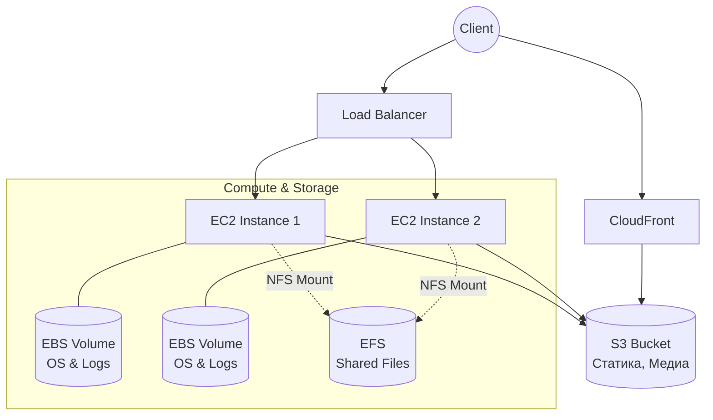

# S3, EBS, EFS (AWS Storage)

## 📖 DevOps-история
**Боль:** Раньше мы хранили все аватарки пользователей и статические файлы прямо на дисках EC2 (EBS). Когда инстансов стало несколько за балансировщиком, начался хаос: аватарка, загруженная на один сервер, не отображалась при следующем запросе, попавшем на другой сервер. Мы попытались настроить периодическую синхронизацию (rsync), но это привело к задержкам и рассинхронизации.
**Решение:** Мы разделили типы хранилищ. ОС и временные файлы оставили на EBS. Статику (аватарки, картинки) перенесли в объектное хранилище S3, раздавая через CloudFront. А для легаси-приложения, которое требовало общую файловую систему, подключили EFS (NFS), смонтировав его одновременно на все воркер-ноды.

## 🏗 Архитектура



## 🛠 Примеры (Terraform / bash)

**Terraform: Создание S3 bucket и EFS**
```hcl
# S3 Bucket для статики
resource "aws_s3_bucket" "media" {
  bucket = "my-company-media-bucket"
}

resource "aws_s3_bucket_public_access_block" "media_pab" {
  bucket = aws_s3_bucket.media.id
  block_public_acls       = true
  block_public_policy     = true
  ignore_public_acls      = true
  restrict_public_buckets = true
}

# EFS для общего доступа
resource "aws_efs_file_system" "shared_data" {
  creation_token = "shared-data-efs"
  encrypted      = true
}

resource "aws_efs_mount_target" "az_a" {
  file_system_id  = aws_efs_file_system.shared_data.id
  subnet_id       = aws_subnet.private_a.id
  security_groups = [aws_security_group.efs_sg.id]
}
```

**bash: Монтирование EFS на EC2 (в User Data)**
```bash
#!/bin/bash
apt-get update && apt-get install -y amazon-efs-utils
mkdir -p /mnt/efs
# fs-12345678 - ID вашего EFS
echo "fs-12345678:/ /mnt/efs efs _netdev,tls 0 0" >> /etc/fstab
mount -a
```

## ⚙️ Day 2 Operations (Советы по эксплуатации)
- **S3 Lifecycle Policies:** Настройте автоматический перенос старых логов/бекапов из S3 Standard в Glacier через 30-90 дней, а затем их удаление, чтобы не платить за "мертвый груз".
- **EBS Snapshots:** Настройте Data Lifecycle Manager (DLM) для регулярного создания снепшотов EBS-дисков с базами данных (с консистентностью на уровне приложения, если нужно).
- **EFS Bursting vs Provisioned:** Следите за метрикой `BurstCreditBalance` в CloudWatch для EFS. Если кредиты падают до нуля (при интенсивном I/O), производительность сильно деградирует. Возможно, стоит перейти на Provisioned Throughput.
- **S3 Versioning:** Обязательно включайте версионирование для критичных бакетов (например, с Terraform state), чтобы защититься от случайных удалений или перезаписи (ransomware).

## 🚫 Антипаттерны
- **Публичные S3 бакеты по умолчанию:** Нельзя делать бакеты публичными, если они не предназначены строго для раздачи ассетов (и даже тогда лучше использовать CloudFront с OAC).
- **Использование EBS как сетевой шары:** Попытки подключить один стандартный EBS-диск к нескольким инстансам (EBS Multi-Attach имеет строгие ограничения и не заменяет NFS/EFS для обычных файлов).
- **Много мелких файлов в EFS:** EFS плохо справляется с миллионами мелких файлов (высокий latency на операции метаданных). Для таких задач лучше подходит S3 или локальные инстанс-стораджи (NVMe).
- **Хранение паролей и секретов в S3 в открытом виде:** Для этого есть AWS Secrets Manager или Parameter Store.
