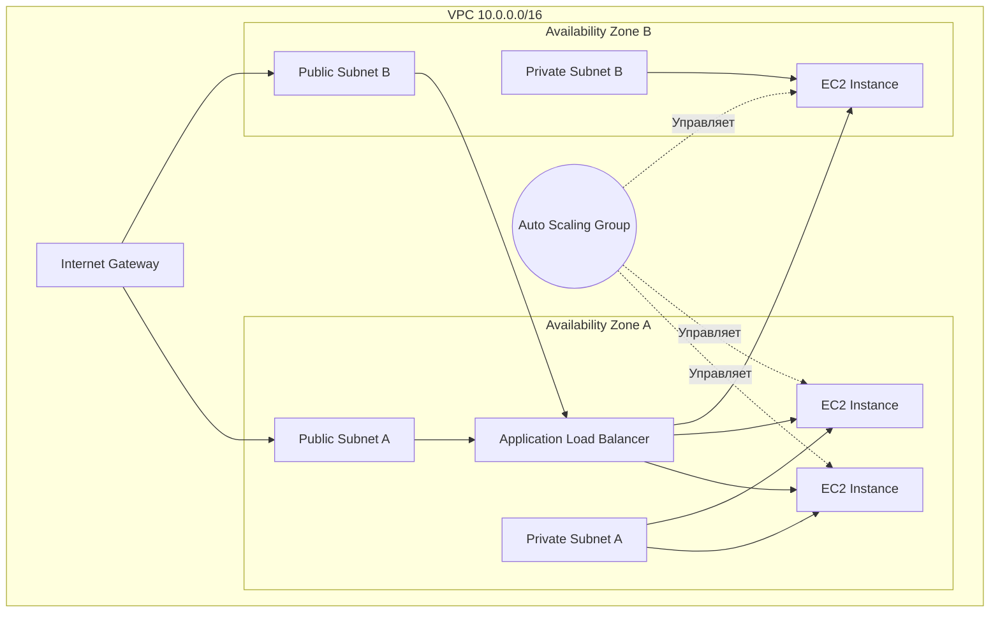

# VPC, EC2, Auto Scaling

## 📖 DevOps-история
**Боль:** Проект рос, и мы разворачивали всё на паре огромных "pets" серверов прямо в дефолтном VPC. Однажды из-за скачка трафика во время маркетинговой кампании серверы легли от нехватки ресурсов. Вдобавок выяснилось, что базы данных торчали наружу без должной изоляции, что вызвало вопросы у безопасников.
**Решение:** Мы спроектировали собственную VPC с публичными (для ALB) и приватными (для EC2 и RDS) подсетями. Перешли от "pets" к "cattle" — упаковали приложение в AMI (с помощью Packer) и настроили Auto Scaling Group. Теперь при росте нагрузки новые инстансы поднимаются автоматически, а базы данных надежно спрятаны в приватном контуре.

## 🏗 Архитектура



## 🛠 Примеры (Terraform / YAML)

**Terraform: Создание Auto Scaling Group и Launch Template**
```hcl
resource "aws_launch_template" "app" {
  name_prefix   = "app-"
  image_id      = "ami-1234567890abcdef0"
  instance_type = "t3.micro"
  
  network_interfaces {
    associate_public_ip_address = false
    security_groups             = [aws_security_group.app_sg.id]
  }

  user_data = base64encode(<<-EOF
              #!/bin/bash
              systemctl start my-app
              EOF
  )
}

resource "aws_autoscaling_group" "app_asg" {
  vpc_zone_identifier = [aws_subnet.private_a.id, aws_subnet.private_b.id]
  desired_capacity    = 2
  max_size            = 5
  min_size            = 2

  launch_template {
    id      = aws_launch_template.app.id
    version = "$Latest"
  }
}
```

## ⚙️ Day 2 Operations (Советы по эксплуатации)
- **Golden AMIs:** Используйте Packer для регулярной сборки обновленных базовых образов (патчи ОС, обновленные агенты логирования).
- **Graceful Shutdown:** Настройте Lifecycle Hooks в Auto Scaling Group. Это позволит инстансу корректно завершить обработку текущих запросов перед удалением.
- **Spot Instances:** Смешивайте On-Demand и Spot инстансы в одной ASG (через MixedInstancesPolicy), чтобы снизить затраты на некритичную вычислительную нагрузку.
- **VPC Flow Logs:** Обязательно включите Flow Logs и отправляйте их в CloudWatch или S3 для траблшутинга сетевых проблем и аудита безопасности.

## 🚫 Антипаттерны
- **Дефолтный VPC для продакшена:** Использование дефолтного VPC с публичными IP для всех сервисов — огромный риск безопасности.
- **SSH в каждый инстанс:** Открытие порта 22 наружу и использование бастионов. Вместо этого используйте **AWS Systems Manager Session Manager (SSM)**.
- **Хранение стейта на EC2:** Сохранение сессий пользователей или логов на локальном диске (EBS) в рамках ASG. При scale-in эти данные будут потеряны безвозвратно.
- **Один огромный инстанс вместо нескольких маленьких:** Лишает вас отказоустойчивости. При падении одной AZ вы потеряете весь сервис.
