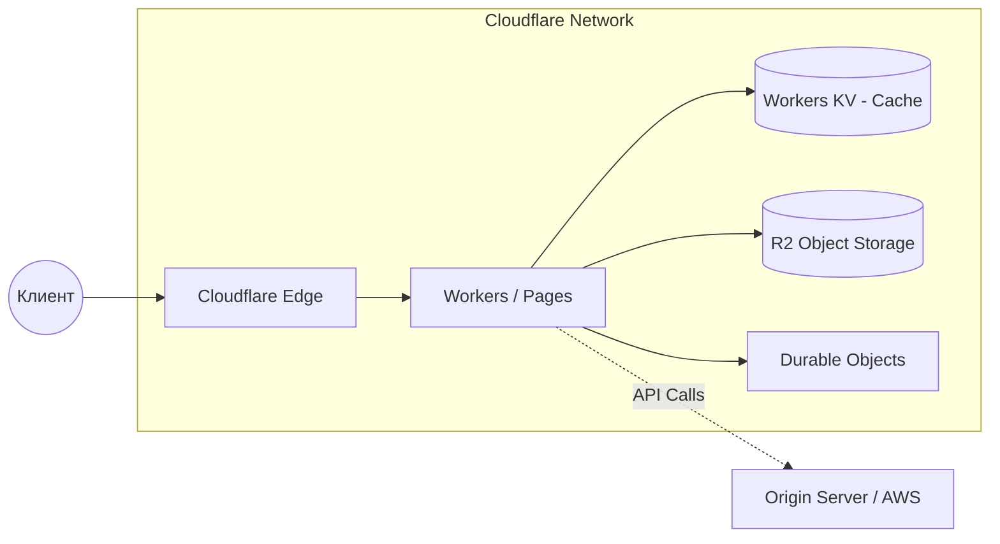

# Cloudflare (как облачная платформа: Workers, R2)

## DevOps-история (Боль и Решение)
**Боль:** Egress-трафик (исходящий) из AWS S3 съедает весь бюджет, а бекенд страдает от "холодных стартов" serverless-функций и задержек при маршрутизации пользователей из разных регионов.
**Решение:** Перенос статики и медиа в Cloudflare R2 (с нулевой стоимостью egress-трафика) и перенос легковесной логики на границу сети (Edge) с помощью Cloudflare Workers, которые запускаются за миллисекунды.

## Архитектура


## Примеры

### Развертывание Worker (wrangler.toml)
```toml
name = "edge-api"
main = "src/index.js"
compatibility_date = "2023-10-01"

# Привязка R2 бакета
[[r2_buckets]]
binding = "MY_BUCKET"
bucket_name = "devops-assets"

# Привязка KV
[[kv_namespaces]]
binding = "CONFIG_KV"
id = "xxxxxxxxxxxxxxxxx"
```

### Код Worker (Обращение к R2)
```javascript
export default {
  async fetch(request, env, ctx) {
    const url = new URL(request.url);
    const key = url.pathname.slice(1);

    if (request.method === 'GET') {
      const object = await env.MY_BUCKET.get(key);
      if (object === null) {
        return new Response('Object Not Found', { status: 404 });
      }
      const headers = new Headers();
      object.writeHttpMetadata(headers);
      headers.set('etag', object.httpEtag);
      return new Response(object.body, { headers });
    }
    return new Response('Method Not Allowed', { status: 405 });
  },
};
```

## Day 2 Operations (Советы)
- **CI/CD с Wrangler:** Используйте GitHub Actions или GitLab CI совместно с CLI-утилитой `wrangler` для автоматического деплоя Workers.
- **Logpush:** Настройте Cloudflare Logpush для отправки логов доступа и логов Workers в ваш централизованный SIEM или хранилище (например, Datadog или тот же R2) для аудита.
- **Wrangler Tail:** Используйте `wrangler tail` для дебага ошибок в production в реальном времени.

## Антипаттерны
- **Тяжелые вычисления на Edge:** Workers имеют жесткие лимиты на время выполнения (CPU time). Не пытайтесь рендерить тяжелое видео или парсить огромные файлы.
- **Игнорирование локального тестирования:** Деплой сразу в прод. Используйте `wrangler dev` (Miniflare) для полноценного локального тестирования.
- **Толстые бандлы:** Загрузка тяжелых npm-пакетов в Worker, что увеличивает время загрузки скрипта и бьет по лимитам размера.
