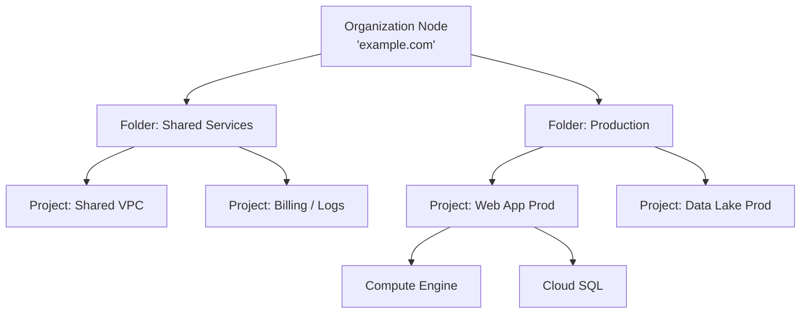

# Основы Google Cloud Platform (GCP)

## История (Боль и Решение)
**Боль:** Команда пыталась масштабировать проект на голом железе, тонула в управлении правами доступа, а ресурсы создавались руками через веб-консоль, что приводило к configuration drift и огромным счетам за забытые виртуалки.
**Решение:** Переезд в GCP с использованием Infrastructure as Code (Terraform). Настроили строгую иерархию проектов (Projects) и папок (Folders), внедрили IAM с принципом наименьших привилегий (Least Privilege) и включили Billing Alerts, чтобы держать расходы под контролем. Теперь инфраструктура поднимается за минуты, доступы гранулярны, а бюджет защищен.

## Архитектура: Иерархия ресурсов GCP


## Примеры

### Bash: Создание проекта и привязка биллинга
```bash
# Создание нового проекта
gcloud projects create my-awesome-prod-project \
    --name="My Prod Project" \
    --set-as-default

# Привязка проекта к Billing Account
BILLING_ACCOUNT_ID=$(gcloud beta billing accounts list --format="value(name)" --limit=1)
gcloud beta billing projects link my-awesome-prod-project \
    --billing-account=$BILLING_ACCOUNT_ID

# Включение необходимых API
gcloud services enable compute.googleapis.com
gcloud services enable container.googleapis.com
```

### Terraform: Базовая настройка IAM
```hcl
# Предоставление роли разработчику на уровне проекта
resource "google_project_iam_member" "dev_viewer" {
  project = "my-awesome-prod-project"
  role    = "roles/viewer"
  member  = "user:developer@example.com"
}

# Использование Custom Service Account для GKE
resource "google_service_account" "gke_sa" {
  account_id   = "gke-node-sa"
  display_name = "GKE Node Service Account"
}

resource "google_project_iam_member" "gke_metric_writer" {
  project = "my-awesome-prod-project"
  role    = "roles/monitoring.metricWriter"
  member  = "serviceAccount:${google_service_account.gke_sa.email}"
}
```

## Day 2 Operations (Советы)
- **Изоляция окружений:** Используйте разные GCP Projects для Dev, Staging и Prod. Проект в GCP — это жесткая граница изоляции, квот и биллинга.
- **Организация сети:** Рассмотрите использование Shared VPC (в отдельном проекте), чтобы сетевая команда могла централизованно управлять IP-адресами, подсетями и файрволами для всех остальных проектов.
- **Управление затратами:** Настройте Budget Alerts сразу после создания Billing Account. Экспортируйте детальный биллинг в BigQuery для последующего анализа и создания дашбордов в Looker Studio.

## Антипаттерны
- ❌ **Примитивные роли:** Использование ролей Owner/Editor/Viewer в Production. Всегда используйте Predefined roles (например, `roles/compute.admin`) или Custom roles.
- ❌ **Дефолтные сервисные аккаунты:** Использование Compute Engine default service account с ролью Editor на весь проект. Создавайте отдельные Service Accounts под каждое приложение.
- ❌ **Default VPC:** Использование сети `default` со всеми открытыми подсетями и автоматическим созданием правил фаервола. Удаляйте её при создании проекта и используйте Custom VPC.
