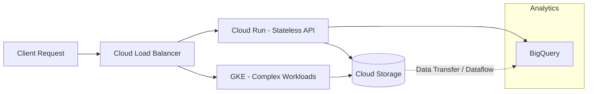

# GKE, Cloud Run, Cloud Storage, BigQuery

## 📖 DevOps-история
**Боль:** Компания разворачивала микросервисы вручную на виртуалках. Деплой занимал часы, масштабирование приводило к даунтаймам. Логи и данные пользователей хранились локально на дисках, а аналитика собиралась медленно и с большими трудозатратами.
**Решение:** Перенос stateless сервисов в Cloud Run (pay-as-you-go и автоскейл до нуля), сложных stateful и микросервисных нагрузок — в GKE. Статика и бэкапы уехали в Cloud Storage, а логи и бизнес-данные начали стримиться в BigQuery для мгновенной масштабируемой аналитики.

## 🏗 Архитектура данных и вычислений


## 💻 Примеры (YAML / bash)

**1. Развертывание в Cloud Run:**
```bash
gcloud run deploy my-api \
    --image=gcr.io/my-project/my-api:v1.2.0 \
    --region=europe-west1 \
    --allow-unauthenticated \
    --max-instances=10 \
    --set-env-vars="DB_HOST=10.0.1.5"
```

**2. Манифест для GKE (с ограничением ресурсов):**
```yaml
apiVersion: apps/v1
kind: Deployment
metadata:
  name: background-worker
spec:
  replicas: 3
  selector:
    matchLabels:
      app: worker
  template:
    metadata:
      labels:
        app: worker
    spec:
      containers:
      - name: worker
        image: gcr.io/my-project/worker:v2
        resources:
          requests:
            cpu: "250m"
            memory: "512Mi"
          limits:
            cpu: "500m"
            memory: "1Gi"
```

## 🛠 Day 2 Operations
- **GKE Upgrades:** Используйте *Release Channels* (например, Regular) для автоматического и предсказуемого обновления кластеров. Обязательно внедрите `PodDisruptionBudgets` (PDB) для защиты от даунтайма при обновлениях.
- **Контроль расходов Cloud Run:** Обязательно устанавливайте `--max-instances`, чтобы предотвратить биллинг-атаки (например, внезапный спайк трафика, который скейлит приложение в космос).
- **Оптимизация BigQuery:** Всегда используйте партиционирование (Partitioning) и кластеризацию (Clustering) таблиц (например, по дате). Ограничивайте квоты на объем сканируемых данных на уровне проекта/пользователя (Custom Quotas).
- **Жизненный цикл GCS:** Настройте *Object Lifecycle Management* для автоматического переноса старых бэкапов в более дешевые классы хранения (Coldline/Archive) и их последующего удаления.

## 🚨 Антипаттерны
1. **`SELECT *` в BigQuery:** Самый быстрый способ сжечь бюджет. BQ берет деньги за объем прочитанных данных, поэтому всегда указывайте только нужные колонки.
2. **GKE для простых сайтов:** Разворачивание GKE кластера для одного простого API или веб-приложения (лучше используйте Cloud Run — дешевле, масштабируется быстрее и не требует администрирования Kubernetes).
3. **Публичные бакеты GCS:** Случайное выставление прав `allUsers` на чтение в бакетах с чувствительными данными (используйте Uniform bucket-level access для строгого контроля через IAM).
4. **Отсутствие Request/Limits в GKE:** Запуск подов без указания лимитов ресурсов, что может привести к OOM (Out Of Memory) узлов, выселению других подов и каскадному падению кластера (проблема "noisy neighbor").
