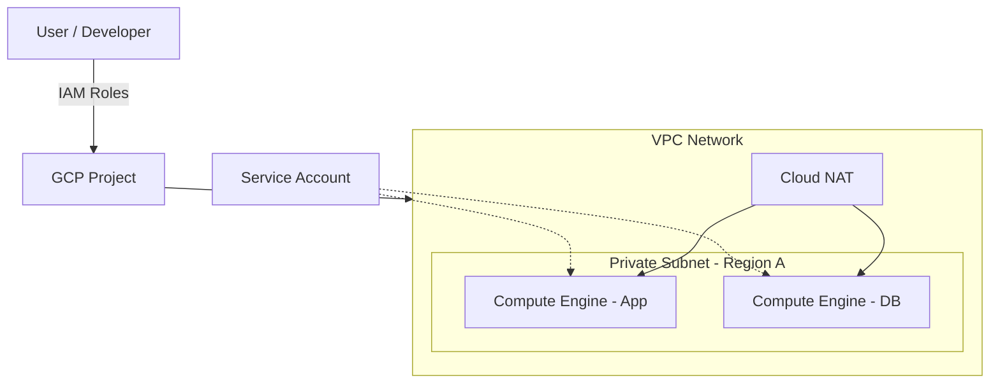

# IAM, VPC, Compute Engine (GCP Foundation)

## 📖 DevOps-история
**Боль:** Стартап рос быстро. Все разработчики имели роль `Editor` на проект, а все сервисы крутились в `default` VPC с публичными IP. Итог: кто-то случайно удалил боевую базу, а через уязвимость в забытой виртуалке запустили майнер. 
**Решение:** Внедрение Principle of Least Privilege через IAM, создание кастомной VPC с приватными подсетями и Cloud NAT, изоляция Compute Engine с помощью строгих сервисных аккаунтов.

## 🏗 Архитектура


## 💻 Примеры (gcloud)

**1. Создание кастомной VPC и приватной подсети:**
```bash
gcloud compute networks create prod-vpc --subnet-mode=custom

gcloud compute networks subnets create prod-subnet-eu \
    --network=prod-vpc \
    --region=europe-west1 \
    --range=10.0.1.0/24 \
    --enable-private-ip-google-access
```

**2. Создание VM с привязкой сервисного аккаунта (без публичного IP):**
```bash
gcloud compute instances create app-server-01 \
    --zone=europe-west1-b \
    --machine-type=e2-medium \
    --network=prod-vpc \
    --subnet=prod-subnet-eu \
    --no-address \
    --service-account=app-sa@my-project.iam.gserviceaccount.com \
    --scopes=https://www.googleapis.com/auth/cloud-platform
```

## 🛠 Day 2 Operations
- **Аудит доступов:** Регулярно используйте *IAM Policy Analyzer* и *Recommender* для отзыва неиспользуемых прав.
- **Мониторинг сети:** Включайте *VPC Flow Logs* для критичных подсетей, чтобы отслеживать аномальный трафик или устранять неполадки (troubleshooting).
- **Оптимизация затрат (Compute Engine):** Используйте *Committed Use Discounts (CUD)* для стабильной нагрузки и *Spot Instances* для batch-ворклоадов. Настройте расписание выключения dev-стендов на ночь.

## 🚨 Антипаттерны
1. **Примитивные роли:** Использование ролей `Owner`, `Editor`, `Viewer` на уровне продакшен-проекта (дают слишком широкие права).
2. **Default VPC:** Использование `default` сети. Всегда удаляйте её при создании нового проекта и стройте кастомную, изолированную топологию.
3. **Долгоживущие ключи:** Экспорт Service Account JSON ключей и их хранение в репозиториях (лучше использовать Workload Identity для интеграций).
4. **Публичные IP:** Раздача External IP виртуалкам (для выхода в интернет используйте Cloud NAT, для безопасного SSH/RDP-доступа админов — Identity-Aware Proxy (IAP)).
