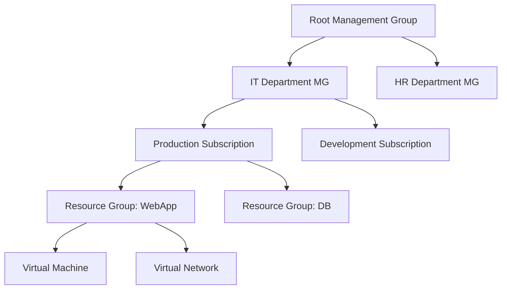

# Основы Microsoft Azure

## 📖 DevOps-история (Боль и Решение)
**Боль:** Компания переехала в облако. Разработчики создают виртуальные машины где попало. В конце месяца приходит счет на $10,000, и никто не может понять, кто потратил эти деньги и для каких проектов работают сервера.
**Решение:** Внедрить иерархию управления: **Management Groups**, **Subscriptions** и **Resource Groups**. Обязательное использование тегов (Tags) через **Azure Policy** для разделения затрат (Cost Allocation) и строгий **RBAC**.

## 🏗 Архитектура управления ресурсами



## 💻 Примеры

### Azure CLI (Bash): Создание базовой инфраструктуры
```bash
# Логин в Azure
az login

# Создание Resource Group в регионе West Europe
az group create --name rg-myapp-prod-weu-001 --location westeurope --tags Environment=Prod Owner=DevOps

# Создание Storage Account
az storage account create \
  --name stmyappprod001 \
  --resource-group rg-myapp-prod-weu-001 \
  --location westeurope \
  --sku Standard_LRS
```

### Bicep: Политика обязательных тегов
```bicep
targetScope = 'subscription'

resource requireTag 'Microsoft.Authorization/policyAssignments@2020-09-01' = {
  name: 'require-environment-tag'
  properties: {
    policyDefinitionId: '/providers/Microsoft.Authorization/policyDefinitions/1e30110a-5ceb-460c-a204-c1c3969c6d62'
    parameters: {
      tagName: {
        value: 'Environment'
      }
    }
  }
}
```

## 🛠 Day 2 Operations
- **Cost Management:** Установите Budgets на уровне подписок с отправкой алертов при достижении 75% и 90% от лимита.
- **Azure Advisor:** Регулярно проверяйте рекомендации Advisor, он бесплатно находит простаивающие ресурсы и бреши в безопасности.
- **Инфраструктура как код (IaC):** Переходите от кликанья в портале к использованию Terraform, Bicep или ARM-шаблонов для всех ресурсов.

## 🚫 Антипаттерны
- ❌ Все ресурсы в одной Resource Group. RG должен объединять ресурсы с одинаковым жизненным циклом (например, приложение и его база данных).
- ❌ Раздача роли `Contributor` или `Owner` на уровне подписки для всех разработчиков. Используйте принцип наименьших привилегий.
- ❌ Игнорирование Naming Conventions. Имена ресурсов вроде `test-vm-1` приведут к хаосу; используйте стандартизированные префиксы (например, `vm-app-prod-weu-001`).
