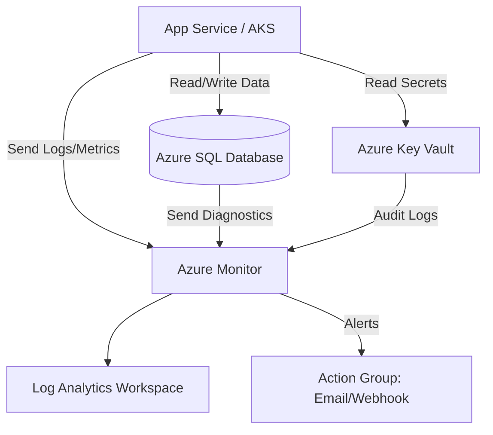

# Azure SQL, Key Vault, Monitor

## История (Боль и Решение)
**Боль:** Мы развернули приложение в Azure, но пароли от БД лежали в открытом виде в конфигурации, база падала под нагрузкой без нашего ведома, а расследование инцидентов сводилось к перебору логов по разным ресурсам.
**Решение:** Вынесли секреты в Azure Key Vault, перенесли базу в управляемый Azure SQL Database, а сбор метрик и логов централизовали через Azure Monitor и Log Analytics. Теперь приложение получает секреты динамически (через Managed Identity), база сама масштабируется, а алерты срабатывают до того, как пользователи заметят проблемы.

## Архитектура


## Примеры

### Bash: Создание Azure SQL с интеграцией Key Vault
```bash
# Создание Key Vault и сохранение пароля
az keyvault create --name "mykeyvault" --resource-group "myRG" --location "westeurope"
az keyvault secret set --vault-name "mykeyvault" --name "sql-admin-pass" --value "Super$ecretP@ss1!"

# Создание логического сервера Azure SQL
az sql server create \
  --name "mysqldbserver" \
  --resource-group "myRG" \
  --location "westeurope" \
  --admin-user "sqladmin" \
  --admin-password "$(az keyvault secret show --vault-name "mykeyvault" --name "sql-admin-pass" --query value -o tsv)"
```

### Terraform: Настройка алертов Azure Monitor
```hcl
resource "azurerm_monitor_metric_alert" "sql_cpu" {
  name                = "high-cpu-sql"
  resource_group_name = azurerm_resource_group.rg.name
  scopes              = [azurerm_mssql_database.db.id]
  description         = "Action will be triggered when CPU count is greater than 80."

  criteria {
    metric_namespace = "Microsoft.Sql/servers/databases"
    metric_name      = "cpu_percent"
    aggregation      = "Average"
    operator         = "GreaterThan"
    threshold        = 80
  }

  action {
    action_group_id = azurerm_monitor_action_group.main.id
  }
}
```

## Day 2 Operations (Советы)
- **Azure SQL:** Настройте автоматическое масштабирование (Serverless tier) или используйте эластичные пулы для экономии, если баз много. Регулярно проверяйте рекомендации Azure Advisor по индексам.
- **Key Vault:** Включите Soft Delete и Purge Protection, чтобы случайно не удалить важные сертификаты и ключи навсегда. Настройте аудит доступа к секретам.
- **Azure Monitor:** Разделяйте Log Analytics Workspaces только при необходимости (по compliance или регионам), в остальных случаях используйте один Workspace для корреляции логов. Создавайте дашборды в Azure Dashboards или Grafana (через Azure Monitor DataSource).

## Антипаттерны
- ❌ **Hardcoded secrets:** Хранение ключей доступа к базе в переменных окружения App Service вместо использования Managed Identities + Key Vault.
- ❌ **Alert fatigue:** Создание алертов на каждый "чих" (например, CPU > 50% на 1 минуту). Настраивайте алерты только на actionable события.
- ❌ **Public endpoint:** Оставлять публичный доступ к Azure SQL. Всегда используйте Private Endpoints (Azure Private Link) для изоляции трафика внутри VNet.
