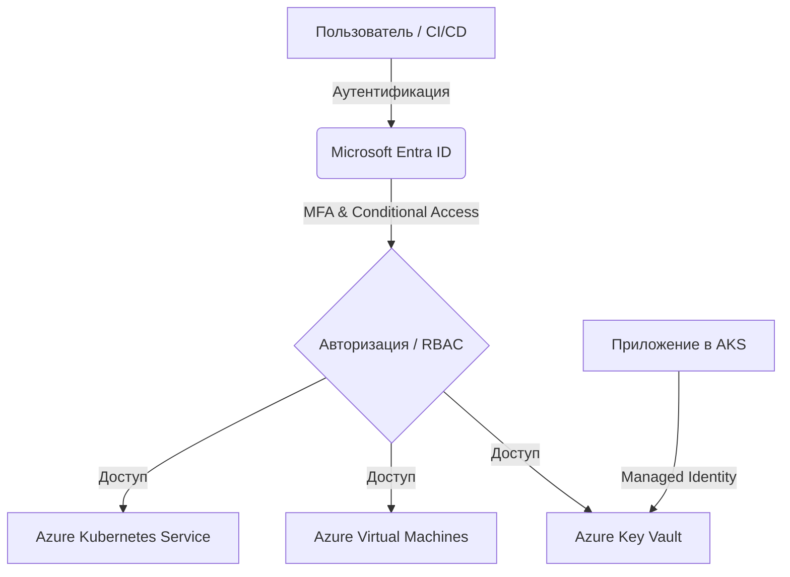

# Microsoft Entra ID (ex-Azure AD)

## 📖 DevOps-история (Боль и Решение)
**Боль:** Разрозненное управление доступами к сотням сервисов, обилие локальных учеток и сервисных паролей, зашитых в CI/CD пайплайны. Ушедший сотрудник оставляет за собой работающие ключи доступа.
**Решение:** Внедрение Microsoft Entra ID как единого Identity Provider (IdP). Использование Service Principals, Managed Identities и RBAC для централизованного контроля, SSO и Conditional Access.

## 📊 Архитектура (Mermaid)


## 💻 Примеры

### Bash: Создание Service Principal для CI/CD
```bash
# Создание Service Principal с правами Contributor на подписку
az ad sp create-for-rbac \
  --name "sp-cicd-github-actions" \
  --role contributor \
  --scopes /subscriptions/00000000-0000-0000-0000-000000000000 \
  --sdk-auth
```

### Terraform: Создание группы и назначение прав
```hcl
data "azuread_client_config" "current" {}

resource "azuread_group" "devops_team" {
  display_name     = "DevOps-Team"
  security_enabled = true
}

resource "azurerm_role_assignment" "devops_aks_admin" {
  scope                = azurerm_kubernetes_cluster.aks.id
  role_definition_name = "Azure Kubernetes Service RBAC Cluster Admin"
  principal_id         = azuread_group.devops_team.object_id
}
```

## 🛠 Day 2 Operations (Эксплуатация)
1. **Ревизия доступов:** Регулярное использование *Access Reviews* для автоматического отзыва неиспользуемых прав.
2. **Ротация секретов:** Настройка автоматического оповещения и ротации секретов (Client Secrets) для Service Principals до их истечения.
3. **Мониторинг аномалий:** Интеграция Sign-in логов и Audit логов с Azure Monitor / Microsoft Sentinel для отслеживания подозрительных попыток входа (например, impossible travel).

## ⚠️ Антипаттерны
- **Вездесущий Owner:** Выдача роли `Owner` или `Contributor` на корневой Management Group / Подписку разработчикам.
- **Статичные учетки для сервисов:** Использование обычных Service Principals с паролями там, где можно применить **Managed Identities** (система сама управляет ротацией).
- **Слепая вера (Zero MFA):** Отсутствие Conditional Access и MFA для привилегированных ролей (Global Admin).
