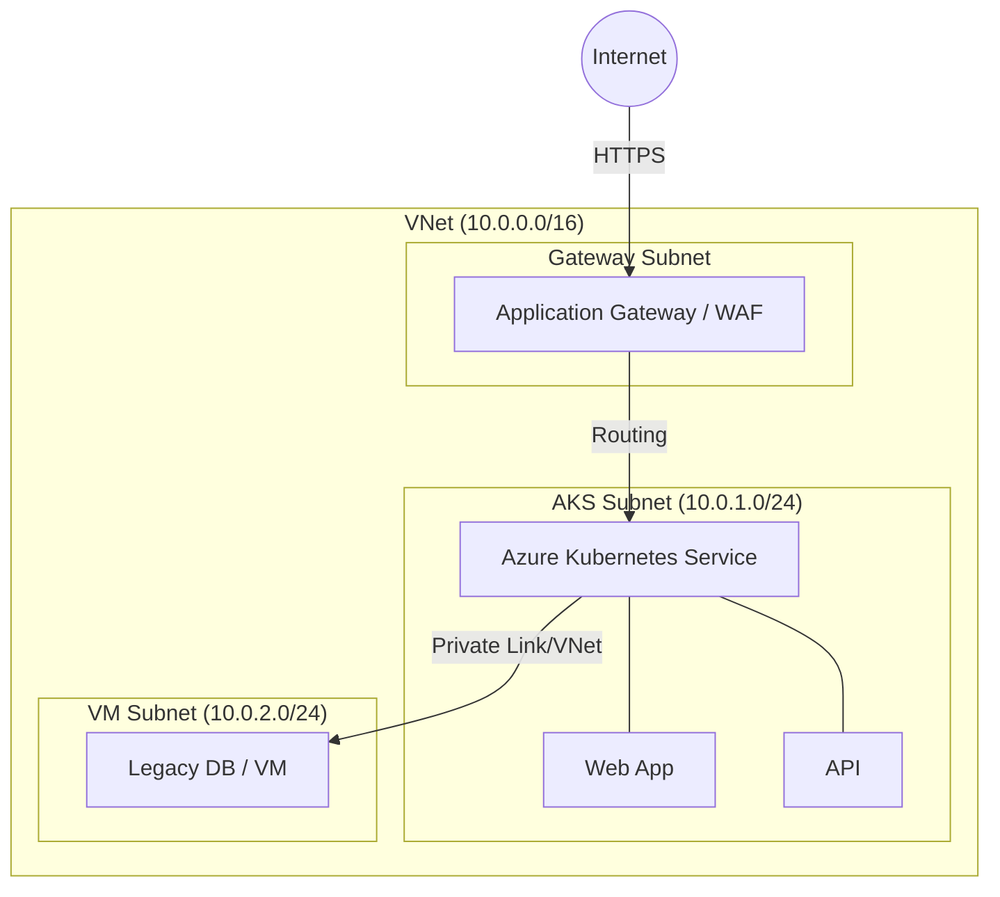

# Инфраструктура Azure: VNet, VM, AKS

## 📖 DevOps-история (Боль и Решение)
**Боль:** Хаотичное создание виртуальных машин, пересекающиеся IP-адреса, базы данных, торчащие наружу портами, и "хрупкая" инфраструктура, которая падает при наплыве трафика.
**Решение:** Проектирование Hub-and-Spoke сети (VNet), изоляция legacy-нагрузок на VM, и миграция микросервисов в управляемый кластер Azure Kubernetes Service (AKS) с гибким автомасштабированием.

## 📊 Архитектура (Mermaid)


## 💻 Примеры

### Bash: Создание кластера AKS с привязкой к VNet
```bash
# Создание VNet и Subnet
az network vnet create -g rg-prod --name vnet-prod --address-prefix 10.0.0.0/16
az network vnet subnet create -g rg-prod --vnet-name vnet-prod --name aks-subnet --address-prefixes 10.0.1.0/24

SUBNET_ID=$(az network vnet subnet show -g rg-prod --vnet-name vnet-prod --name aks-subnet --query id -o tsv)

# Создание AKS кластера
az aks create \
  --resource-group rg-prod \
  --name aks-prod \
  --node-count 3 \
  --network-plugin azure \
  --vnet-subnet-id $SUBNET_ID \
  --enable-managed-identity \
  --generate-ssh-keys
```

### YAML: Внедрение Azure Application Gateway Ingress (AGIC)
```yaml
apiVersion: networking.k8s.io/v1
kind: Ingress
metadata:
  name: web-ingress
  annotations:
    kubernetes.io/ingress.class: azure/application-gateway
spec:
  rules:
  - host: api.example.com
    http:
      paths:
      - path: /
        pathType: Prefix
        backend:
          service:
            name: api-service
            port: 
              number: 80
```

## 🛠 Day 2 Operations (Эксплуатация)
1. **Обновление AKS:** Регулярное использование `az aks upgrade` для поддержания актуальной версии Kubernetes (у Azure строгая политика deprecation).
2. **Network Security:** Использование NSG (Network Security Groups) на уровне подсетей и включение Flow Logs в Azure Network Watcher для аудита трафика.
3. **Автомасштабирование:** Включение Cluster Autoscaler в AKS и Horizontal Pod Autoscaler (HPA) для обработки пиковых нагрузок.
4. **Управление патчами VM:** Настройка Azure Update Manager для автоматической установки security-патчей на виртуальные машины.

## ⚠️ Антипаттерны
- **Публичные IP где попало:** Назначение Public IP напрямую виртуальным машинам вместо использования Load Balancer, Application Gateway или Azure Bastion.
- **Всё в одной подсети:** Смешивание control plane, баз данных и публичных ingress-сервисов в одном subnet.
- **Игнорирование лимитов в AKS:** Развертывание подов без `resources.requests` и `resources.limits`, что приводит к OOM-киллам и падению нод кластера.
