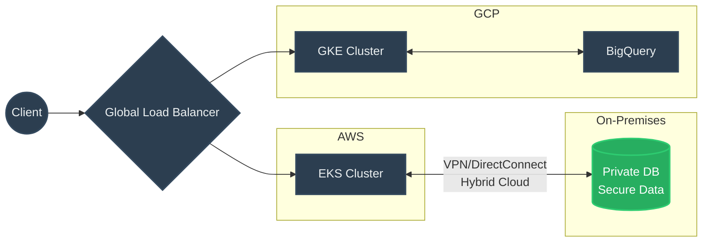

# Multi-Cloud и Hybrid Cloud

## DevOps-история: Боль и Решение
**Боль:** Бизнес требует высочайшей отказоустойчивости (в случае падения целого региона или провайдера), а служба безопасности строго запрещает хранить чувствительные персональные данные вне периметра компании.
**Решение:** 
- **Hybrid Cloud:** Хранение БД с персданными в собственном ЦОД (On-Prem), а веб-сервисы масштабируются в публичном облаке (AWS/GCP), связываясь через защищенный VPN/Direct Connect.
- **Multi-Cloud:** Развертывание кластеров Kubernetes сразу в AWS и Azure для катастрофоустойчивости и использования уникальных фич каждого провайдера (например, BigQuery в GCP и ML сервисы в AWS).

## Архитектура / Схема


## Примеры (Код/Конфиги)
**Пример Multi-Cloud конфигурации провайдеров в Terraform:**
```hcl
terraform {
  required_providers {
    aws = {
      source  = "hashicorp/aws"
      version = "~> 5.0"
    }
    google = {
      source  = "hashicorp/google"
      version = "~> 5.0"
    }
  }
}

provider "aws" {
  region = "us-east-1"
  alias  = "primary"
}

provider "google" {
  project = "my-multi-cloud-project"
  region  = "europe-west1"
  alias   = "analytics"
}
```

## Day 2 Operations (Советы)
- **Единый Control Plane:** Используйте инструменты вроде Azure Arc, Anthos или Rancher для унифицированного управления кластерами в разных облаках.
- **Сетевая связность:** Мониторинг latency и пропускной способности каналов между облаками (и On-Prem) критичен. Настройте динамическую BGP маршрутизацию и резервные IPSec-туннели.
- **CI/CD и абстракция:** Пайплайны должны быть максимально абстрагированы от конкретного облака. Собирайте универсальные образы контейнеров и доставляйте артефакты через Helm/Kustomize.

## Антипаттерны
- **Наивный Multi-Cloud (Data Gravity):** Попытка распределить микросервисы между AWS и GCP, которые активно общаются друг с другом. Это приведет к огромным счетам за egress-трафик и неприемлемым задержкам (latency).
- **Lowest Common Denominator:** Написание абстрактных оберток над API облаков (попытка использовать только те сервисы, которые одинаково работают везде), теряя преимущества уникальных фич каждого конкретного провайдера.
- **Ручное управление гибридной сетью:** Настройка VPN/туннелей руками без инфраструктуры как код (IaC) и без автоматического мониторинга состояния BGP-сессий.
