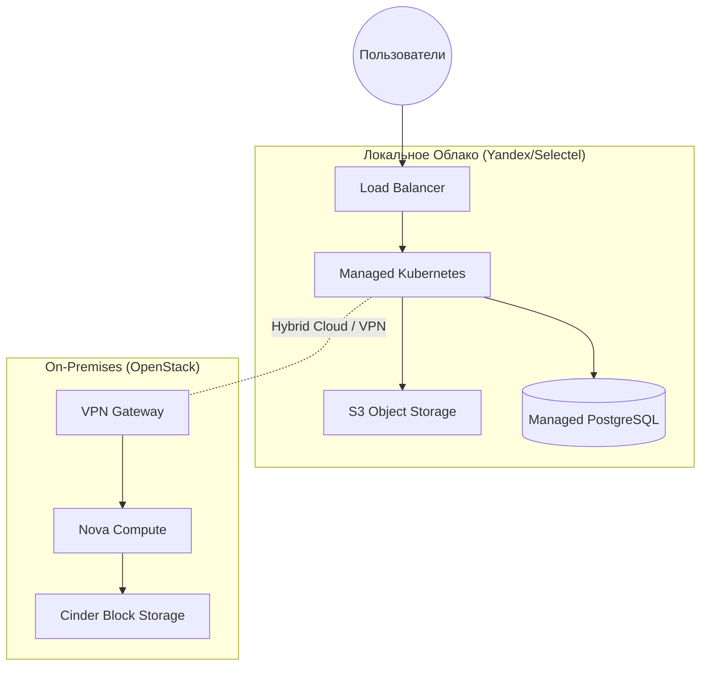

# Альтернативы (Yandex Cloud, Selectel, OpenStack)

## DevOps-история (Боль и Решение)
**Боль:** Глобальные гиперскейлеры (AWS, GCP, Azure) стали недоступны, дороги из-за курсовых разниц или не подходят под требования регуляторов (ФЗ-152) по локализации данных.
**Решение:** Миграция на локальных провайдеров (Yandex Cloud, Selectel) для публичного облака или построение собственного приватного облака на OpenStack для полного контроля над инфраструктурой.

## Архитектура


## Примеры

### Terraform: Развертывание ВМ в Yandex Cloud
```hcl
terraform {
  required_providers {
    yandex = {
      source = "yandex-cloud/yandex"
    }
  }
}

provider "yandex" {
  token     = "YOUR_OAUTH_TOKEN"
  cloud_id  = "YOUR_CLOUD_ID"
  folder_id = "YOUR_FOLDER_ID"
  zone      = "ru-central1-a"
}

resource "yandex_compute_instance" "vm-1" {
  name = "devops-vm"
  resources {
    cores  = 2
    memory = 4
  }
  boot_disk {
    initialize_params {
      image_id = "fd8mfc6omiki5govl68h" # Ubuntu 20.04
    }
  }
  network_interface {
    subnet_id = yandex_vpc_subnet.subnet-1.id
    nat       = true
  }
}
```

## Day 2 Operations (Советы)
- **Billing Alerts:** Настройте бюджеты и алерты на перерасход средств — локальные провайдеры могут списывать средства очень быстро при ошибках в IaC.
- **Quota Management:** Регулярно проверяйте и запрашивайте увеличение лимитов (CPU, IP-адреса) в Yandex/Selectel заранее, до масштабирования.
- **OpenStack Upgrades:** Обновления OpenStack — это боль. Используйте инструменты вроде Kolla-Ansible или OpenStack-Helm для контейнеризированного развертывания control plane.

## Антипаттерны
- **ClickOps:** Создание ресурсов через веб-консоль. Инфраструктура в локальных облаках должна управляться через Terraform/Pulumi так же строго, как и в AWS.
- **Глубокий Vendor Lock-in:** Использование уникальных PaaS-решений провайдера, если нет уверенности в его стабильности. Лучше использовать базовые IaaS и Managed Kubernetes.
- **Забытые Floating IP:** Оставленные висеть без дела публичные IP-адреса, за которые продолжает списываться плата.
