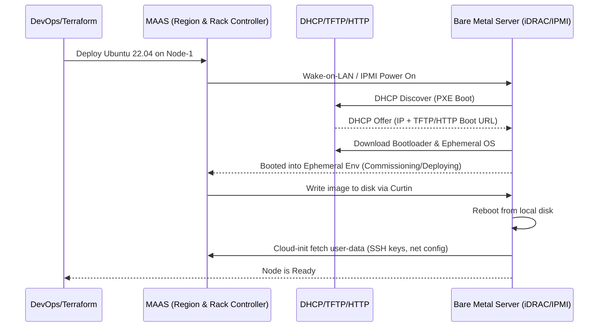

# Bare Metal (IPMI, iDRAC, PXE, MAAS)

## DevOps-история (Боль и Решение)
**Боль:** Дата-центр закупил 50 новых физических серверов. Инженеру нужно вставить флешку в каждый, установить ОС, настроить сеть, добавить SSH-ключи. Это занимает дни рутинной, подверженной ошибкам работы. Управление питанием (включение/выключение) требует физического присутствия.
**Решение:** Использование технологий Out-of-Band управления (IPMI, iDRAC, iLO) для удаленного контроля железа. Внедрение стека автоматизированного provisioning (PXE, DHCP, TFTP, Cloud-Init) или готовых решений вроде Canonical MAAS (Metal as a Service), что позволяет относиться к физическим серверам как к облачным инстансам (Bare Metal Cloud) и разворачивать их за минуты.

## Архитектура (MAAS / PXE Boot)



## Примеры (CLI / Bash)

**Пример Bash: Использование `ipmitool` для управления питанием**
```bash
# Проверка статуса питания
ipmitool -I lanplus -H 10.0.0.100 -U admin -P secret power status

# Жесткая перезагрузка сервера
ipmitool -I lanplus -H 10.0.0.100 -U admin -P secret power reset

# Установка загрузки по сети (PXE) на следующий бут
ipmitool -I lanplus -H 10.0.0.100 -U admin -P secret chassis bootdev pxe
```

**Пример Terraform: Развертывание физического сервера через MAAS**
```hcl
terraform {
  required_providers {
    maas = {
      source  = "maas/maas"
      version = "~> 2.0"
    }
  }
}

provider "maas" {
  api_version = "2.0"
  api_key     = "YOUR_MAAS_API_KEY"
  api_url     = "http://10.0.0.10:5240/MAAS"
}

# Выделение машины с определенными тегами
resource "maas_machine" "k8s_worker" {
}

# Развертывание ОС на выделенной машине
resource "maas_instance" "k8s_worker_node" {
  allocate_params {
    tags = ["worker", "high-cpu"]
  }
  deploy_params {
    distro_series = "jammy" # Ubuntu 22.04
    user_data     = file("cloud-init.yaml")
  }
}
```

## Day 2 Operations (Советы)
- **Управление прошивками (Firmware):** Автоматизируйте обновление BIOS/UEFI, прошивок RAID-контроллеров и сетевых карт. Некоторые производители предоставляют API (Redfish) для этого.
- **Redfish API:** Переходите с устаревшего протокола IPMI на современный RESTful стандарт Redfish для управления железом. Он использует JSON и HTTP, что намного проще интегрировать в скрипты.
- **Сетевая безопасность:** Выделяйте интерфейсы управления (IPMI, iDRAC, iLO) в отдельный изолированный Management VLAN. Никогда не выставляйте их в интернет.
- **Hardware Inventory:** MAAS отлично справляется с инвентаризацией железа. Используйте commissioning фазу для сбора данных о дисках, CPU, RAM и экспорта их в вашу CMDB (например, NetBox).

## Антипаттерны
- ❌ **Установка ОС с флешки:** Хождение по дата-центру (или использование виртуальных консолей) для ручной установки ОС. Используйте PXE/MAAS/Tinkerbell/Cobbler.
- ❌ **Хардкод паролей IPMI:** Использование паролей по умолчанию (`admin/admin`, `root/calvin`) или хранение их в plaintext. Настраивайте интеграцию с LDAP/Active Directory или используйте Vault.
- ❌ **Игнорирование аппаратных алертов:** Не собирать SNMP/Redfish трапы об отказах дисков, сбоях памяти (ECC) или перегреве блоков питания. Настраивайте мониторинг железа до установки ОС.
